# Logical Replication Slot Failover in Multigres

## Context

Multigres proxies logical replication from a client, through the Multigateway, through a Multipooler, to
PostgreSQL. Today this only works for **temporary** slots: the gateway preamble explicitly rejects any
non-temporary `CREATE_REPLICATION_SLOT` / `pg_create_logical_replication_slot(...)` because Multigres cannot
yet transition a replication slot's position across a primary failover. A mid-stream failover simply tears the
tunnel down and closes the replication stream.

The goal of this work is to make a _persistent_ logical replication slot survive a primary failover, so a
logical subscriber can keep consuming across a promotion without a full re-seed. The end goal is that it
should look like a single server and there should be no loss of data during a failover.

This document describes how logical replication and its failover work in PostgreSQL, then the implementation,
which is based on native PostgreSQL 17 slot sync. A fully-DIY catch-up alternative (the Patroni model) was
considered and is recorded in Appendix A.

Failover requires Postgres version 17 or later, so Postgres native sync-slot feature is available. If
necessary to support earlier versions, there are extensions that can handle the logical slot failover.

### Current state

Logical replication already works through Multigres today, but only for the lifetime of a single connection to
a single primary:

- A client connects in walsender logical mode; the gateway relays the `CREATE_REPLICATION_SLOT` /
  `START_REPLICATION` handshake to the primary's Postgres and then hands the connection off to a byte-blind
  tunnel that relays the stream verbatim. The gateway never interprets the stream, so it tracks no LSN and keeps
  no state.
- The stream is pinned to the **primary** (the writable leader) through a single pooler backend reserved for the
  session.
- Only **temporary** slots are allowed. A temporary slot lives only for that session and Postgres drops it when
  the connection closes.
- With no durable slot state and no LSN tracking, a primary failover simply tears the tunnel down and the
  consumer must reconnect and re-seed from scratch.

Rejecting non-temporary slots is deliberate: a persistent slot would not exist on a promoted standby (slot
state is not in the WAL) and would leak WAL retention on the primary after the client disconnected. A
temporary slot has neither problem because it is inherently ephemeral. Everything below exists to lift this
restriction.

---

## Part 1. Background: how logical replication and its failover work

Before going into details about the problems that we need to solve to handle logical replication failover, it
is useful to discuss how logical replication is set up, what the effect of each step is, and why they are
necessary. To avoid confusion, we will call a Postgres server an _instance_ rather than the traditional term
_cluster_ since the word "cluster" can mean "cluster of servers" or "cluster of databases". We will refer to a
cluster of Postgres instances as a _cluster_.

On a high level, logical replication can be used to replicate changes from a _source instance_ (or just
_source_) to a _consumer_. Note that the consumer is _not_ part of the cohort and is, for example, an external
Postgres server with a completely different setup.

### 1.1 Configuring for logical replication failover

This section sets up logical replication whose slot can **fail over** to a standby. That takes two parts: the
consumer-side publication and subscription shown here (created with `failover = true`), and the source-cluster
configuration that lets the slot be synced to standbys — most importantly a [physical replication
slot](https://www.postgresql.org/docs/17/warm-standby.html#STREAMING-REPLICATION-SLOTS) between the primary
and each standby, together with the standby-side settings — which §1.5 covers in full. Both are required:
without the cluster-side setup a `failover = true` subscription still creates a slot, but nothing propagates
it to a standby, so it cannot actually fail over.

As an example, to set up a physical replication slot for a standby, you need to pick a name for the standby,
say `standby_1`, and create the physical replication slot on the primary using
[`pg_create_physical_replication_slot`](https://www.postgresql.org/docs/17/functions-admin.html#FUNCTIONS-REPLICATION):

```sql
SELECT pg_create_physical_replication_slot('standby_1');
```

You then point the standby at that slot by setting
[`primary_slot_name`](https://www.postgresql.org/docs/17/runtime-config-replication.html#GUC-PRIMARY-SLOT-NAME)
and reloading the configuration. `primary_slot_name` is reload-only (no restart needed), takes effect only
while the node is a standby, and `ALTER SYSTEM` persists it to `postgresql.auto.conf`:

```sql
ALTER SYSTEM SET primary_slot_name = 'standby_1';
SELECT pg_reload_conf();
```

In Multigres the manager creates and names these per-follower physical slots automatically (§4.3); the calls
above are what the vanilla-PostgreSQL equivalent looks like.

### 1.2 Setting up logical replication

Once the servers are configured for [logical
replication](https://www.postgresql.org/docs/17/logical-replication.html), you can actually use it to
replicate from a cluster to a _consumer_ (for example, a Postgres server outside the cluster, or a CDC
pipeline).

To set up [logical replication](https://www.postgresql.org/docs/17/logical-replication.html), it is necessary
to create a _publication_ on the source instance using the [`CREATE
PUBLICATION`](https://www.postgresql.org/docs/17/sql-createpublication.html) command for the tables that you
want replicated. This makes it possible for consumers to connect and read the WAL. The publication contains
information about what tables are published and some information about how they are published (for example, it
allows partitioned tables to publish rows as if they belong to the partitioned root table rather than an
individual partition).

For example, to create a publication for the tables `orders` and `order_details` you can use:

```sql
CREATE PUBLICATION orders_pub FOR TABLE orders, order_details;
```

This allows subscribers to read all columns of the two tables, but not any other tables.

Once the publication is created, you can create a subscription on the consumer Postgres instance, which will
refer to the publication on the source.

Note that you need to create all the tables that you want to replicate _before_ you create the subscription.
This is easiest done using something like:

```bash
# Dump the table definitions from the source, then load them into the consumer.
pg_dump --schema-only --no-owner --no-privileges -t public.orders -t public.order_details \
  "host=primary port=5432 dbname=postgres user=postgres" >schema.sql
psql "host=consumer port=5432 dbname=postgres user=postgres" -f schema.sql
```

For example, to create a subscription with [`CREATE
SUBSCRIPTION`](https://www.postgresql.org/docs/17/sql-createsubscription.html) that reads all tables in the
publication and allows the logical replication slot to fail over to a standby you use:

```sql
CREATE SUBSCRIPTION orders_sub
  CONNECTION 'host=primary port=5432 dbname=postgres user=postgres'
  PUBLICATION orders_pub
  WITH (failover = true, copy_data = true);
```

Since the option `copy_data` is enabled, it will also do an initial copy of the tables before starting logical
replication. You will see how the `failover = true` is used below.

> **NOTE:** If you try to create a subscription on a different database but in the same instance, the command
> will hang. There are workarounds for this, but since that is not a normal setup they are omitted here.

### 1.3 How does logical replication work?

Logical replication works by reading the physical events written to the WAL and then extracting logical
replication events from the WAL. There are no special "logical events" written to the WAL, it is all a matter
of [logical decoding](https://www.postgresql.org/docs/17/logicaldecoding.html) of what has always been written
to the WAL as part of normal transaction execution. As a result, enough WAL needs to be available on the
instance to decode events from the LSN that the client has requested.

To ensure that enough WAL is kept for all subscribers, each subscriber creates a _replication slot_ on the
source. The slot will track how much of the WAL the consumer has read. This allows the server to decide which
WAL segments need to be kept to replicate data to the consumer.

The slot contains, among other data, the fields [`restart_lsn` and
`catalog_xmin`](https://www.postgresql.org/docs/17/view-pg-replication-slots.html), which are important for
deciding how much WAL needs to be kept.

**Field `restart_lsn`** tracks the oldest WAL it may still need to re-read. A source instance keeps WAL back
to the minimum `restart_lsn` across its slots and recycles anything older. If no slot holds on to the LSN that
is needed, the segments are recycled and decoding fails with _"requested WAL segment has already been
removed"_. So the slot is what stops the WAL it needs from being thrown away.

**Field `catalog_xmin`** is used to ensure that catalog rows are kept so that decoding the WAL can work.
Decoding turns physical WAL back into logical row changes using the catalog _as it was at the time of each
change_. If the schema has changed since, the older catalog definitions are required, and `catalog_xmin` is
used to ensure that the old catalog definitions are available.

Both fields, along with the rest of a slot's state, are exposed by the
[`pg_replication_slots`](https://www.postgresql.org/docs/17/view-pg-replication-slots.html) view — the primary
way to inspect a slot on the server that owns it:

```sql
SELECT slot_name, slot_type, active, restart_lsn, catalog_xmin
  FROM pg_replication_slots
 WHERE slot_name = 'orders_sub';
```

```text
 slot_name  | slot_type | active | restart_lsn | catalog_xmin
------------+-----------+--------+-------------+--------------
 orders_sub | logical   | t      | 0/1A2B3C8   |          748
```

The same view carries the failover-related columns (`failover`, `synced`, `temporary`, `invalidation_reason`)
used later in §1.5 and §3.1.2.

Two PostgreSQL settings extend this picture to a _standby_, and understanding why they exist here — with the
mechanism — makes the later configuration (Part 2) obvious:

- **`hot_standby_feedback`** is the standby-side counterpart to `catalog_xmin`. The retention above only holds
  catalog rows on the server that _owns_ the slot; a standby, replaying the primary's vacuum, would drop exactly
  the catalog rows a slot on that standby needs to decode older WAL, invalidating it. With `hot_standby_feedback
= on` the standby continuously reports its oldest needed xmin back to the primary, so the primary holds its
  _own_ vacuum horizon back and never removes catalog rows a standby still needs. That is what keeps a slot on a
  standby decodable.
- **`sync_replication_slots`** exists because slot state is not in the WAL stream: physical replication ships a
  standby all the _data_ but none of the _slots_ (a slot lives in `pg_replslot` on the server that owns it).
  With it `on`, a dedicated slot-sync worker on the standby connects back to the primary and copies the
  `failover = true` slots across, which is the only way a slot comes to exist on a standby at all.

These are the two knobs that make it possible for a replication slot to survive a failover; §1.5 and Part 2
describe how they are used together.

### 1.4 Options to control WAL retention

The amount of WAL kept on disk is bounded by three settings:

- **Option [`max_wal_size`](https://www.postgresql.org/docs/17/runtime-config-wal.html#GUC-MAX-WAL-SIZE)** is a
  _soft_ target for how much WAL accumulates between checkpoints. Exceeding it triggers a checkpoint so older
  segments can be recycled. It bounds routine WAL, not slot or standby retention, and is not a hard cap.
- **Option
  [`wal_keep_size`](https://www.postgresql.org/docs/17/runtime-config-replication.html#GUC-WAL-KEEP-SIZE)** is a
  minimum amount of recent WAL to retain for standbys that connect _without a slot_, so a briefly disconnected
  replica can reconnect without a reseed.
- **Option
  [`max_slot_wal_keep_size`](https://www.postgresql.org/docs/17/runtime-config-replication.html#GUC-MAX-SLOT-WAL-KEEP-SIZE)**
  is the maximum WAL a replication slot may pin. If a slot's `restart_lsn` would force retention beyond this,
  the slot is invalidated at the next checkpoint instead of letting WAL grow unbounded.

> **NOTE:** Once a slot is invalidated (`pg_replication_slots.wal_status = 'lost'`, `invalidation_reason =
'wal_removed'`), the WAL it needed is gone and there is no incremental recovery. The consumer must re-seed:
> drop the dead slot and re-create the subscription with `copy_data = true`, which starts a fresh slot at the
> current position and re-copies every table into a consistent base before resuming. That full re-copy is
> exactly the re-seed this design exists to avoid, which is why the failover machinery must keep the slot
> continuously WAL- and catalog-retained rather than letting it lag past `max_slot_wal_keep_size`.

### 1.5 Logical slot sync worker and failover

In the `CREATE SUBSCRIPTION` above we used `failover = true` to make sure that the replication slot [fails
over to standbys](https://www.postgresql.org/docs/17/logical-replication-failover.html). The slot is not
written to the WAL, so there is no replication that can make sure that the slot exists on the standbys.

Instead, Postgres implements a dedicated _slot-sync worker_ whose only purpose is to synchronize replication
slots between the primary and a standby. Adding the `failover = true` means that this background worker will
look at the slot and replicate the state to the standby.

In addition, we have the following requirements for the primary and the standby:

- For the primary it is mandatory to have a [physical replication
  slot](https://www.postgresql.org/docs/17/warm-standby.html#STREAMING-REPLICATION-SLOTS) between the primary
  and the standby: [slot synchronization](https://www.postgresql.org/docs/17/logical-replication-failover.html)
  relies on it so the standby can durably hold back the WAL and `catalog_xmin` the synced slots need.
- For the standby, it is necessary to set
  [`sync_replication_slots`](https://www.postgresql.org/docs/17/runtime-config-replication.html#GUC-SYNC-REPLICATION-SLOTS)
  to `true`,
  [`primary_slot_name`](https://www.postgresql.org/docs/17/runtime-config-replication.html#GUC-PRIMARY-SLOT-NAME)
  should be configured to contain the physical replication slot, and
  [`hot_standby_feedback`](https://www.postgresql.org/docs/17/runtime-config-replication.html#GUC-HOT-STANDBY-FEEDBACK)
  must be `on`. It is also necessary to specify a valid dbname in the
  [`primary_conninfo`](https://www.postgresql.org/docs/17/runtime-config-replication.html#GUC-PRIMARY-CONNINFO).

> **NOTE:** A replication slot name may contain only lower-case letters, digits, and the underscore character
> (`[a-z0-9_]`), and be at most 63 characters long. An identifier that contains hyphens or upper-case letters
> must therefore be sanitized to this character set before it can be used as a slot name.

There is an important timing constraint in _when_ the slot-sync worker can persist a slot. When it first
copies a `failover = true` slot to a standby it creates it as _temporary_ (`temporary = true`) and only
promotes it to a persistent, failover-ready slot once the standby has caught up and it is safe to do so. The
safety check is the subtle part: slot-sync **refuses to persist a synced slot whose `catalog_xmin` is behind
the standby's own catalog horizon**, because advancing a slot onto a standby that has already vacuumed away
the catalog rows the slot would need to decode from is exactly the data-loss it must prevent.

This interacts awkwardly with a _freshly created_ slot. A new slot's `catalog_xmin` is **frozen at its
creation point** and only advances once a consumer actually starts consuming: as the consumer streams,
applies, and flushes its position back (the `StandbyStatusUpdate` messages of §1.2), `catalog_xmin` moves
forward. Meanwhile an idle standby's catalog horizon creeps forward on its own (from the periodic
running-xacts snapshots the primary writes). So a brand-new slot that nobody has consumed yet is precisely the
slot that slot-sync will _not_ persist — its `catalog_xmin` sits behind the standby's advancing horizon until
consumption catches it up.

The practical consequence is that a `failover = true` slot is **not immediately failover-ready after
creation**. There is a window — from creation until a consumer streams and advances `catalog_xmin` past the
standbys' horizon — in which the slot exists only on the primary and no standby holds a persistent copy. On an
idle or low-traffic shard that window can be arbitrarily long (nothing advances `catalog_xmin`). This window
is central to the failover semantics and its consequences are examined in detail in §4.4.

The full lifecycle, from creation to a persistent failover-ready slot — note that it is _consumption_ (the
flushes that advance `catalog_xmin`), not the passage of time, that triggers the temporary-to-persistent
transition:

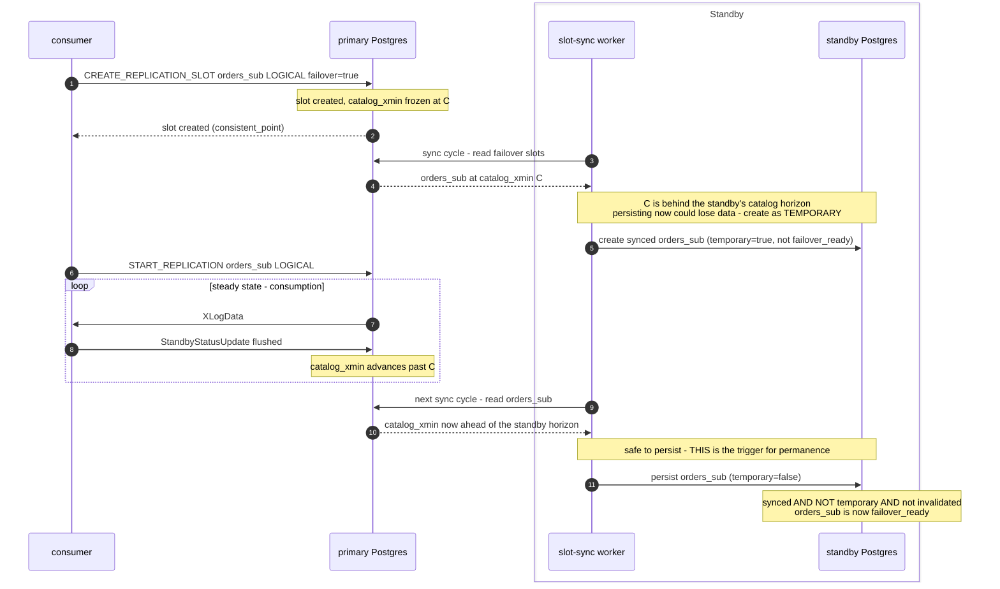

### 1.6 Summary: the problem to solve

Sections 1.1–1.5 explain the mechanics; this is the problem they add up to. Suppose a consumer has replicated
up to some LSN _lsn_, the primary A fails, and a standby B is promoted. For the consumer to **resume** on B —
rather than re-seed from scratch — three things must be true on B:

1. **The logical slot exists on B** under the same name as on A. Slot state is not in the WAL stream: it lives in
   the `pg_replslot` directory _on the server that owns the slot_, so physical replication ships B all of A's
   committed _data_ but none of A's _slots_. Only the slot-sync worker (§1.5) puts the slot on B, and because the
   promotion target is not known in advance, the slot must be synced onto _every_ standby that could be promoted.
2. **The WAL needed to decode from _lsn_ is retained on B** — held by the slot's `restart_lsn` (§1.3–§1.4).
3. **The historical catalog rows needed to interpret that WAL are retained on B** — held by the slot's
   `catalog_xmin` (§1.3), which itself depends on `hot_standby_feedback` and the physical replication slot
   (§1.5).

Two constraints, both established above, make this a _before-the-fact_ problem that cannot be fixed at
promotion time:

- **You cannot create-then-rewind a slot.** A slot created after the fact starts decoding at "now"
  (`pg_replication_slot_advance` is forward-only), and by then the catalog rows for _lsn_ have already been
  vacuumed away. So the slot must exist and be catalog-safe on B _before_ the changes the consumer will replay.
- **A fresh slot is not immediately failover-ready.** Even once created with `failover = true`, the slot becomes
  persistent on a standby only after consumption advances its `catalog_xmin` past the standby's horizon (§1.5) —
  so there is always a window after creation in which no standby holds a usable copy.

Everything in Parts 2–5 exists to satisfy these requirements: keep a named failover slot present,
WAL-retained, and catalog-safe on every standby ahead of any promotion — and define what happens during the
window in which that is not yet true.

---

## Part 2. Implementation: native PostgreSQL 17 slot sync

Starting with Postgres 17, the failover logical slots themselves are created on the primary when a consumer
subscribes with `failover = true` and the native slot-sync worker then copies them to every standby. The
configuration below is the physical-replication and slot-sync plumbing that makes that propagation work,
grouped by _when_ it is applied.

Physical replication slots are named deterministically from each server's own identity (a stable, sanitized,
cluster-unique name). That keeps every server's `primary_slot_name` fixed for its lifetime, and lets whichever
node is currently primary compute exactly which slot names to create for its followers.

Native sync is chosen because it enforces the WAL-retention and catalog-safety guarantees that are otherwise
easy to get subtly wrong (silent data loss). The one significant architectural change it requires is
reintroducing physical replication slots — reversing Multigres's current slot-less posture — whose
WAL-retention risk is bounded by `max_slot_wal_keep_size`.

### 2.1 Changes needed for when the pod starts

These configuration changes are needed when the pod starts, but can remain for the lifetime of the pod. These
changes apply to any member of the cohort.

- Option `wal_level` is set to `logical` to enable logical replication.
- Options `hot_standby_feedback` and `sync_replication_slots` are set to `on`. Both only take effect while the
  node is a standby and are harmless on a primary, so they can be set unconditionally.
- Option `primary_slot_name` should be set to the server's deterministic slot name. It is ignored while the node
  is a primary and used while it is a standby, so it never has to change on promotion or demotion.
- Options `max_wal_senders` and `max_replication_slots` need to be sized for the fan-out. There is one
  additional physical slot per follower, and we need margin for the failover logical slots.
- Whenever `primary_conninfo` is written it must include a valid `dbname`. Slot sync worker connects to that
  database to decide where to read the slot (the `dbname` is ignored for streaming replication).

### 2.2 Changes needed for when a standby is promoted

- Create a physical replication slot for each current follower (using each follower's deterministic name).
  Physical slots are not synced, so a freshly promoted node has none and must create them before its followers
  can attach.
- Set `synchronized_standby_slots` to those followers' physical slots. If no follower has attached yet, leave it
  empty to avoid stalling logical decoding, and set it once they do.
- **Log** (do not gate on) the readiness of the node's synced failover slots. This is advisory only — promotion
  proceeds regardless. A fresh slot's `catalog_xmin` does not advance until a consumer has begun consuming
  (§1.5), so a not-yet-ready slot at promotion is _expected_, not an error; blocking the promotion until
  readiness could hang indefinitely on an idle shard and can never be reached once the source primary is gone. A
  slot that is not ready is handled downstream by degrading the consumer to a client-driven re-seed (§3.1.1),
  not by delaying the promotion.

### 2.3 Changes needed for when a primary is demoted

- Repoint `primary_conninfo` at the new primary, keeping the static user / `dbname` / application_name.
- Drop the physical replication slots it held for its former followers. They have no consumer now and would
  otherwise pin WAL indefinitely.
- Drop the logical failover slots it still owns as _un-synced originals_ (`synced = false`). While this node was
  primary it held the writable originals of the failover slots; a standby, by contrast, is only supposed to hold
  the _synced copies_ that its slot-sync worker maintains (`synced = true`). If the un-synced originals are left
  in place, slot-sync cannot create the synced copy — a slot of that name already exists — so the original never
  advances: its `restart_lsn` freezes and Postgres eventually invalidates it (`rows_removed`). An invalidated
  slot makes this node an unusable failover target for that slot, so after a couple of leader rotations the
  cohort runs out of failover-ready targets. Dropping the un-synced originals lets slot-sync recreate them as
  proper synced copies. This is safe precisely because it runs only as the node becomes a standby — the live
  originals live on the current primary, which never takes this path.
- `RESET synchronized_standby_slots`. Primary does not have any followers. The option does not make a difference
  for the standby since it is not consulted for standbys, but if the standby is promoted, the list would be
  wrong.

> **NOTE:** These same steps apply when a _former primary rejoins after a crash_ — or after a failover in which
> it did not diverge and so was **not** rewound (it simply repoints at the new primary and streams). It never ran
> a graceful demotion, so it comes back still holding physical slots for its old followers, the un-synced logical
> failover originals it created while primary, and a stale `synchronized_standby_slots`; all three must be cleaned
> as it rejoins as a standby. The no-rewind case is the important one: a rewind would have discarded the stale
> originals as a side effect, but a clean repoint leaves them behind, which is exactly when the invalidation trap
> above bites.

### 2.4 Changes needed for when a server is added as a new standby to the cohort

- On the current primary: create a physical replication slot named for the new standby and add it to
  `synchronized_standby_slots`.
- On the new standby: point `primary_conninfo` at the current primary (with a valid `dbname`);
  `primary_slot_name`, `hot_standby_feedback`, and `sync_replication_slots` are already in place from pod start.
- The primary's failover logical slots are copied to the new standby by its slot-sync worker automatically.
  Their readiness on the new standby is _observed_, not waited on: a freshly synced slot only becomes
  failover-ready once consumption has advanced its `catalog_xmin` past the standby's horizon (§1.5), so a
  not-yet-ready slot here is expected rather than a fault. The readiness is surfaced through the standby's
  health stream (`failover_slots_ready` / `_total`) and feeds slot-aware leader appointment (Part 5 #11) as a
  tiebreak — it does not block the standby from joining, and a promotion onto a not-ready slot degrades to a
  client-driven re-seed (§3.1.1).
- Repointing an existing standby onto a freshly promoted primary after a failover uses these same steps — from
  the primary's side, every follower attaches the same way.

### 2.5 Changes needed for when a standby is removed from the cohort

- On the current primary: drop the physical replication slot that backed that standby and remove it from
  `synchronized_standby_slots`. This is not optional cleanup — an orphaned physical slot pins WAL on the primary
  indefinitely, and a slot still listed in `synchronized_standby_slots` whose standby is gone **stalls logical
  decoding on the primary** until it is removed.

### 2.6 Ordering constraint: a follower's physical slot must exist before it can stream

A follower's physical slot `mg_<follower>` is created on the **primary** but named for the **follower**, and the
follower sets `primary_slot_name = mg_<self>` unconditionally at startup (it is inert while the node is a
primary, §2.1). A standby's WAL receiver therefore cannot begin streaming until that slot already exists on the
current primary. This makes slot creation a strict _pre-condition_ of streaming, which imposes an ordering rule
on the implementation: **the primary must create a follower's slot independently of whether that follower is
already streaming or already a committed cohort member.**

Getting this ordering wrong deadlocks a follower that joins _after_ the primary was promoted. If the only
triggers that create a follower slot are the promotion hook (over the cohort committed _at promotion_) and a
cohort-add event — and the cohort-add path itself only admits a standby whose WAL receiver is _already
streaming_ — then a late-joining standby can never be slotted: it cannot stream without its slot, and its slot
is never created because it is not streaming. During a staggered bootstrap this typically strands whichever
standby was not yet up at promotion (e.g. the primary creates `mg_2` for the standby it saw and never creates
`mg_0` for the one that came up a moment later). The orchestrator's `FixReplication` remediation then loops on
no-op recovery (re-issuing `SetPrimary` and a `pg_rewind` that reports "no rewind required", WAL receiver never
streaming) because none of its recovery actions create a slot on the primary. A planned switchover of an already-healthy cohort does **not** hit this — every
standby is a committed member at promotion, so the promoting node slots them all in its promotion hook.

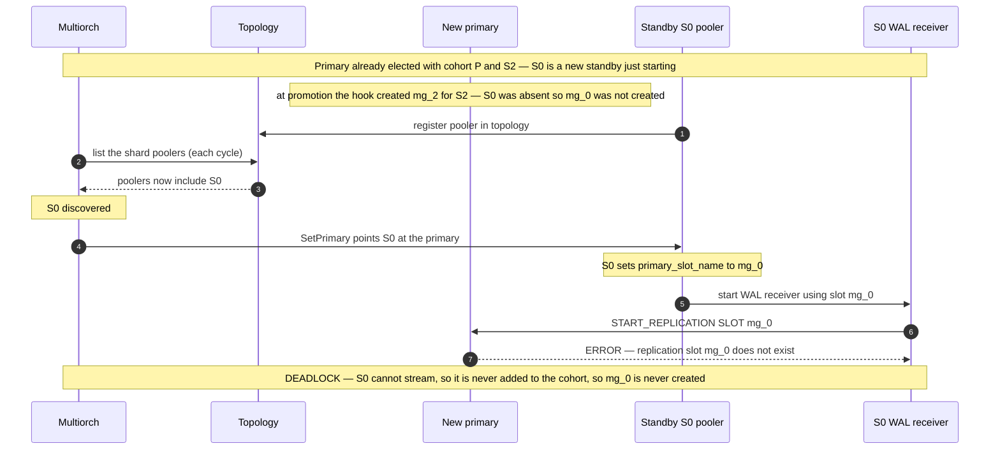

The invariant that avoids this: whichever node is currently primary ensures a physical slot for **every
discovered non-leader member of the shard**, as a standing reconcile, rather than only at consensus cohort
transitions. The scope is deliberately _membership-based, not streaming-gated_ — cohort-**eligible** (a
discovered member that is not the leader), not cohort-**committed** (committed membership is the streaming-gated
state the deadlock hinges on). The leader is identified from consensus state — the highest known shard rule —
never from the topology `Multipooler.Type`, which multiorch must not consult for identity; the eligible set is
therefore exactly the non-leader members the orchestrator already fans `SetPrimary` out to. Creating the slot on
demand when such a member first tries to attach, or reconciling against the discovered non-leader set, both
satisfy the invariant; gating creation on the member's own streaming state does not.

Today the primary only learns about followers through consensus rule updates (`UpdateConsensusRule`, `Recruit`,
`Promote`, `SetPrimary`) — all gated on cohort eligibility, which for an _add_ requires the follower to be
streaming already. There is no discovery-time signal to the primary. The natural home for the early create is
therefore a **discovery-driven reconcile**: the orchestrator already discovers shard members from topology and
health ahead of any streaming (its cycle re-lists the shard's poolers from the topology store), so on
discovering a new **non-leader member** it ensures that follower's physical slot on the primary (idempotently),
and issues the corresponding drop when the member disappears (§2.5). This keeps the primary as the actor that
owns its own PostgreSQL, fires strictly before the standby is pointed at the primary, and — being level-checked
against the discovered non-leader set each cycle — self-heals a missed event or a primary restart on the next
pass.

**On observers.** Multigres does not today model a distinct observer or async-replica role in the shard-member
set multiorch reconciles over: there is no such `PoolerType`, and every pooler the orchestrator discovers for the
shard is treated as a cohort member. The reconcile above therefore covers every discovered member that is not the
leader — the same set `SetPrimary` is already fanned out to — with no role or `Type` filter (multiorch must not
consult `Multipooler.Type`). What keeps a lagging or not-yet-streaming member from doing harm is not exclusion
from the reconcile but the narrow scoping of the durability lists: a member is added to
`synchronized_standby_slots` (whose over-broad membership would stall logical decoding, §2.5) and
`synchronous_standby_names` (durability-quorum membership) only once it is streaming and caught up (below).
Creating an unused physical slot ahead of that is cheap (`restart_lsn = NULL`, pins no WAL). If a genuinely
asynchronous, non-failover-target class of node is introduced later, excluding it from this reconcile must come
from the shard-membership set (or a consensus-derived signal), not from the topology role.

The corrected flow splits the single cohort-add action into an **early create** and a **late register**. The
primary ensures the follower's physical slot as soon as the orchestrator _discovers_ that non-leader
member — before it is pointed at the primary and therefore before it streams — a freshly created, unused slot has `restart_lsn = NULL`
and pins no WAL until a consumer connects, so creating it ahead of time is cheap. Only once the standby is streaming
and caught up does the primary add it to `synchronized_standby_slots` and `synchronous_standby_names`; doing
either earlier would stall logical decoding or block commits. The slot therefore exists before it is needed, and
the streaming gate that deadlocks the old flow is never on the critical path.

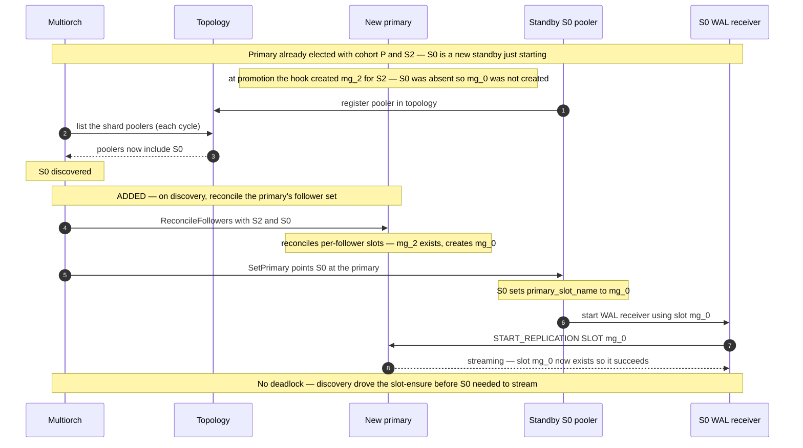

Only the later `synchronized_standby_slots` / `synchronous_standby_names` registration (once S0 is streaming and
caught up) is omitted from the diagram above; it is unchanged from the old flow and, per the split, happens only
after S0 catches up.

On the wire this is a **level-triggered, declarative** call rather than a per-slot imperative: the orchestrator
sends the primary the current set of non-leader followers — call it `ReconcileFollowers` — and the primary
reconciles its per-follower physical slots to match, creating any that are missing and dropping any whose member
has left (§2.5). The request carries only the followers' IDs, no topology role; slot naming (§4.3) stays inside
the pooler, which owns its own PostgreSQL, and `EnsurePhysicalSlot` becomes the internal primitive the handler
calls, not part of the RPC surface. Because the set is re-sent each cycle, a missed event or a primary restart
self-heals on the next pass.

Two complementary hooks make this robust. The **proactive** one is the discovery reconcile above — slots are
ensured before a member is pointed at the primary. The **reactive** one extends the recovery path:
`FixReplication` (the orchestrator's remediation for a cohort member found not replicating) should, as one of
its steps, ensure that member's physical slot exists on the current primary. So if a slot was somehow not
created up front — a race, a lost event, or a restart between discovery and `SetPrimary` — the very recovery
that observes the non-replicating standby also repairs the cause, instead of looping on a no-op `pg_rewind` as
the old flow did. The proactive reconcile keeps the deadlock from arising; the reactive `FixReplication` step
guarantees it cannot persist.

#### 2.6.1 `synchronized_standby_slots` must track cohort membership, not slot activeness

The split above adds a follower to `synchronized_standby_slots` only once it is streaming and caught up, and the
reconcile that maintains that list is driven by **cohort membership**: the list is edited when a follower joins or
leaves the cohort, never in response to a slot flipping active or inactive. This subsection records why — the choice
is a deliberate safety/availability call, not an accident of implementation.

`synchronized_standby_slots` is the only thing that holds logical decoding back to the physical standbys, and it is
_not_ redundant with synchronous replication: PostgreSQL logical decoding does **not** wait for
`synchronous_standby_names`. A transaction is decoded and streamed to the consumer at its commit WAL record, which is
flushed locally _before_ synchronous replication has acknowledged it on a standby. The two GUCs gate different things
— one the client's `COMMIT`, the other the logical stream — so only `synchronized_standby_slots` keeps the consumer
from outrunning the standbys.

**Filtering the list to active slots is safe in the common case.** It is tempting, when a listed-but-inactive slot
stalls decoding (§2.5; Part 5 #7), to drop the inactive entries — `... AND active`. Under a single primary failure
that is in fact safe, provided the active set is non-empty. Decoding is held to the _slowest_ listed slot, so
`consumer ≤ min(active standbys)`; the survivors of a primary-only fault include those active standbys, and leader
appointment promotes the furthest-advanced survivor, giving `consumer ≤ min(active) ≤ max(survivors) = new primary`.
The consumer can never outrun the promoted node. Concretely, with primary A and standbys B (holding `{1,2}`) and C
(holding `{1}`): if C falls inactive and is de-listed, decoding is still held to B, so transaction 2 — already
acknowledged on B under AT_LEAST_2 — is streamed only after B has it; if A then crashes, B is promoted and 2 survives.
De-listing the lagging follower lost nothing.

**It is unsafe only when the holdback collapses below the durability set.** The inequality above has one hole:
`min(∅)`. If the active set _empties_ — every standby momentarily inactive at once, e.g. a total replication outage
during failover churn — decoding has no holdback, and because it does not wait for `synchronous_standby_names` it can
stream a transaction that exists only in the primary's local WAL: flushed and decoded, but not yet acknowledged by any
standby (its `COMMIT` still blocked). A single primary crash then leaves that transaction _only_ downstream — a change
the cluster never durably committed, now live in the subscriber:

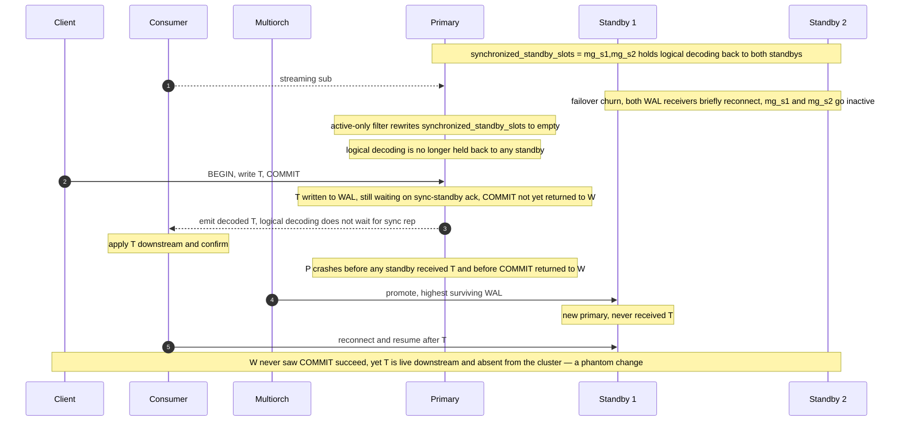

In the sequence above the phantom transaction `T` is streamed to the consumer only after the active-only filter has
emptied `synchronized_standby_slots`, so nothing holds decoding back; `T` reaches the consumer before any standby has
it and before its own `COMMIT` has returned to the writer, and a single primary crash then strands it downstream. A
second, out-of-budget shape exists — the primary _plus_ every standby ahead of the consumer fail, promoting a
de-listed lagging standby — but AT_LEAST_2 tolerates only a single fault, so there the cluster has already lost
acknowledged data on its own and the subscriber divergence is incremental, not new.

**The chosen rule.** Because the failure is specifically decoding _ahead of the durability point_, and because a
membership-driven list is already correct whenever the cohort is stable, Multigres edits `synchronized_standby_slots`
only on a cohort change: a follower is added when it joins and removed when it leaves, never on slot activeness. In the
normal case nothing changes, so a membership edit is only ever a _delayed_ update of an already-correct list — there
is no window in which it risks data loss or a phantom change. A transiently-inactive follower stays listed, and the
only cost is a **bounded stall** of logical decoding until it reconnects or the cohort-remove path drops it: a delay,
never a loss. That is the safe direction in which to fail.

**A cleaner fix likely belongs upstream (out of scope).** The stall exists only because logical decoding gates on
`synchronized_standby_slots` membership rather than on how far `synchronous_standby_names` has actually acknowledged.
Teaching PostgreSQL to let decoding advance up to the LSN the synchronous quorum has already confirmed would drop the
stall _and_ still never let decoding run ahead of the durability point. That needs an upstream change and is out of
scope for this PR; it is noted here as a potential future contribution.

---

## Part 3. Changes to Multigateway

Beyond the PostgreSQL-side configuration of Part 2, the implementation needs changes in two Multigres
services: the **Multigateway** (this part), which relays the consumer's replication stream, and the
**Multipooler** manager (Part 4), which owns the slot lifecycle on PostgreSQL.

The gateway is the client-facing relay. Its replication relay is byte-blind in both directions today. The
changes:

### 3.1 Failing over the replication stream

A failover can be handled two ways, described below. The one this design implements is **client-driven**: the
consumer observes the dropped stream and drives its own reconnect, so the gateway needs no new failover
machinery. Consumers such as another Postgres server already persist their own LSN and reconnect automatically
— the apply worker retries the subscription's connection (the gateway, here) at `wal_retrieve_retry_interval`
and resumes from its replication origin. The second, **gateway-driven**, carries the stream across the
promotion transparently — the single-server goal — but needs an **LSN-aware tap** so the gateway knows the
client's position; it buys transparency, not correctness, and is deferred to a later step. Both depend on the
same underlying question — whether the slot survives the promotion on the new primary — which §3.1.2 examines
in detail.

#### 3.1.1 Client-driven failover

If the client is allowed to observe the failover as a dropped stream, the tap is unnecessary and
**Multigateway needs no new failover machinery**. On a leader change the gateway does exactly what it does
today — tear the tunnel down and route the next connection to the current leader; the client reconnects and
re-issues `START_REPLICATION` from its _own_ durably-tracked position (a subscriber's replication origin, or a
`pg_recvlogical` flush file), and the slot synced to the new primary guarantees that LSN is still decodable.
What newly makes the resume succeed is on the PostgreSQL side — the slot now survives on the new primary via
native sync — not in the gateway; the one gateway-side change, lifting the non-temporary-slot guard (§3.2), is
shared by both approaches. This is the standard PostgreSQL resume model and is simpler (the gateway tracks no
LSN and needs no stream decoding), but it does _not_ look like a single server: the consumer must notice the
disconnect and drive its own reconnect. The tap is precisely what buys the transparent experience.

The client-driven alternative, without the tap — the consumer sees the stream drop and reconnects itself:

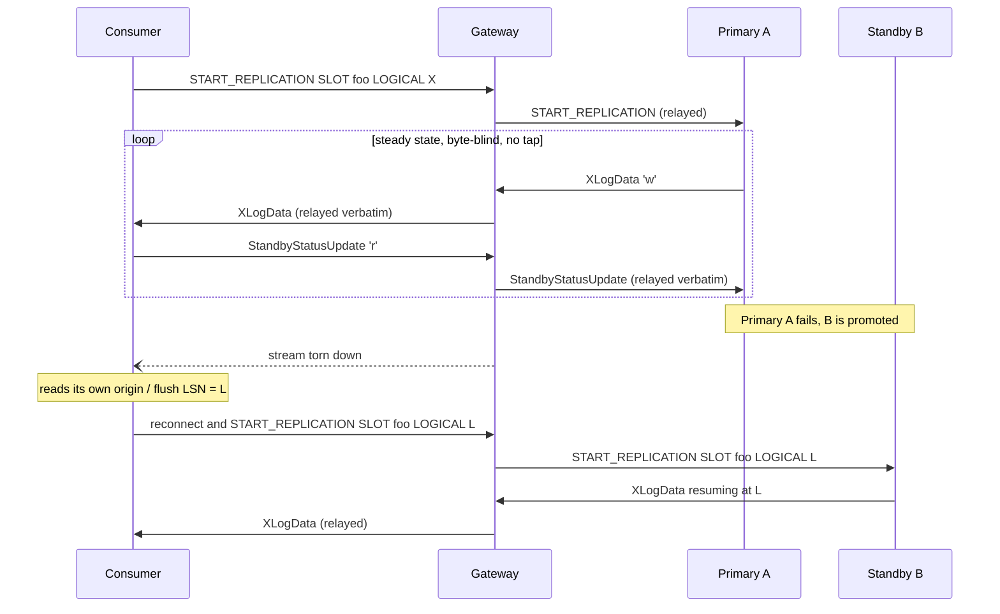

#### 3.1.2 Gateway-driven failover

For the design goal that the cluster looks like a single server, the gateway should carry the stream to the
new primary under the _same_ client connection — without the client ever seeing a disconnect. To resume the
stream on the client's behalf, the gateway must know how far the client has consumed; but it relays
byte-for-byte and so does not track that position. The only place the position appears is _inside_ the stream
— the client's `StandbyStatusUpdate` acknowledgements. So the gateway adds an opt-in tap (persistent failover
slots only; temporary slots keep the byte-blind fast path) that decodes the `CopyData` sub-type byte: on the
**upstream** path `StandbyStatusUpdate` ('r') to capture the client's `flushed` LSN (the resume point), and
optionally `XLogData` / `PrimaryKeepalive` downstream to track the server's WAL end.

On a leader change the gateway does not tear the tunnel down — it carries the stream to the new primary. It
already elects the leader from live health streams (`load_balancer.go`) and forces replication to the leader,
so on failover it waits for the new leader to serve, verifies the slot is `failover_ready` and that the
tracked confirmed LSN is within the WAL the new primary holds (surface/refuse the async tail-loss gap, never
silently skip), and re-opens the stream at the confirmed LSN — the client's `START_REPLICATION` positions it
there, so no explicit slot advance is needed.

The transparent flow the tap enables — the consumer's connection is never dropped:

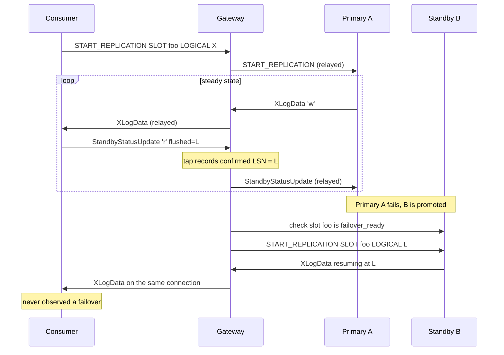

The failure this prevents — today, with no repoint, the tunnel is torn down at failover and the consumer
cannot resume on the new primary, so it is forced into a full re-seed:

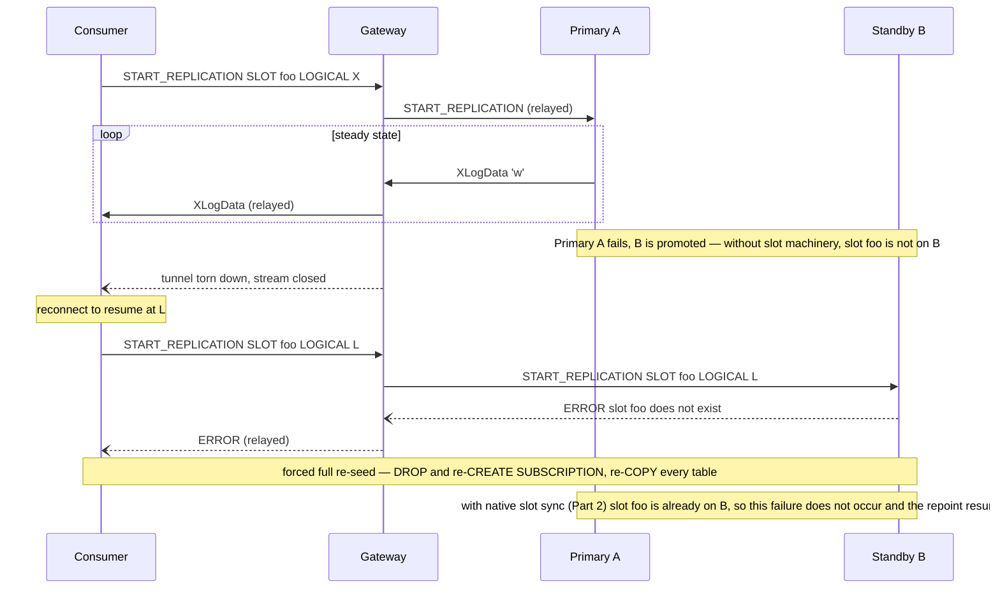

The package `github.com/jackc/pglogrepl` can be used to read the logical replication stream as a client and is
already a direct dependency but used only for the scalar `LSN` type (`pgutil/lsn.go`). Its message decoders
aren't wired and the gateway doesn't import it yet, so this is new wiring on an already-vendored library.
Parse incrementally; treat any decode failure as fall-back-to-teardown, never as stream corruption.

The repoint above only lands cleanly if the new primary's failover slot is already `failover_ready`. That is
the promoted node's responsibility, not the gateway's: in its promotion hook — while still a standby, before
`pg_promote` — the pooler checks once whether its synced failover slots are failover-ready
(`logUnreadyFailoverSlots`, using the `unreadyFailoverSlots` query) and logs any that are not, then promotes
regardless. It does not wait: a slot that is not ready at promotion is in a state a wait could not recover —
invalidated, `synced = false` from broken sync, or simply not yet synced from a source primary that is now
gone — so a wait would only add latency for a state it cannot fix (see the [decision
log](decision-log/2026-08-17-failover-slot-readiness-before-promotion.md)). A slot that had synced is already
ready and usable; one caught mid-sync at the crash degrades to a client-driven re-seed (§3.1.1), which loses
no committed data.

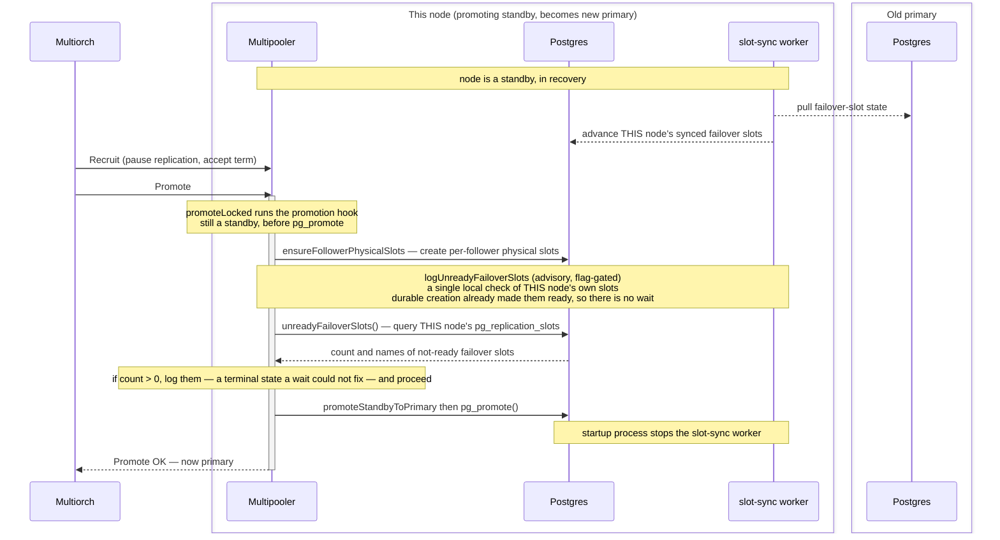

**What makes a slot `failover_ready` — and what promoting without it costs.** `failover_ready` is `synced AND
NOT temporary AND invalidation_reason IS NULL`, and each flag is the product of machinery that only runs while
the source primary is alive and reachable. `synced` means the slot-sync worker created the slot here by
reading the primary's `failover = true` slots. `NOT temporary` is the load-bearing one: PostgreSQL 17 creates
a synced slot as _temporary_ and persists it only once this standby has caught up — replayed WAL past the
`restart_lsn` / `catalog_xmin` it pulled from the primary's slot — so a slot that has not caught up sits
`synced = true, temporary = true` and is _not_ ready. `invalidation_reason IS NULL` means the catalog rows
needed to decode from the slot's position were never vacuumed away, which is exactly what
`hot_standby_feedback` plus the physical slot (§2.1–§2.2) hold. So the `SS-->>PG: advance` step in the diagram
above is really "keep pulling from the live primary until the local slot catches up and flips from temporary
to persistent."

This is why a crash can leave a slot permanently not-ready _on this node_. If the primary crashes before a
given slot has caught up, that slot is frozen `temporary` (and temporary synced slots are dropped at
promotion), and the only thing that could finish it — continued sync from the primary — is now gone; no action
on the promoted node can reconstruct the missing retention. The condition is _per-slot_, not per-server: the
promoted node is a perfectly healthy new primary, every slot that _had_ caught up is ready and usable, and
only the specific slots caught mid-sync are stuck. That is why promotion only logs the not-ready slots and
proceeds (see the [decision log](decision-log/2026-08-17-failover-slot-readiness-before-promotion.md)) — a
hard gate would hang the promotion forever in exactly this case, since readiness can never be reached once the
source primary is gone, and a wait would only add latency for a state it cannot fix. A slot caught mid-sync at
the crash is the pre-sync window §4.4 describes: the consumer degrades to a client-driven re-seed (§3.1.1),
which loses no committed data.

Promoting with a not-ready slot does _not_ lose committed data: the new primary's heap and WAL already hold
every transaction it received (the async tail-loss window in Part 5 is a separate matter). What is lost is the
_decode context_ — the `catalog_xmin` retention — for the range between the consumer's last confirmed LSN and
now, so the new primary can no longer deliver the incremental change stream for that window even though the
underlying rows are present. The consequence depends on the consumer. A state-replicating consumer (a logical
replica that only needs matching final state) recovers correct state by re-seeding (`DROP` / `CREATE
SUBSCRIPTION` → full re-`COPY`) — expensive, but lossless. An event- or CDC-oriented consumer (an audit log, a
warehouse, a queue — where each change matters) permanently loses the discrete events in the gap: the re-seed
snapshot shows only final state, so a row inserted _and_ deleted within the window never appears, and an
`UPDATE a→b→c` collapses to `c`. That permanent loss for event consumers is the residual cost of a crash in
the pre-sync window (§4.4) — a window Multigres shrinks by creating the slot up front and syncing
continuously, but does not eliminate. It is not _silent_: the readiness check flags an absent or not-ready
slot on the new primary and degrades to a re-seed rather than resuming into a gap.

**Worked example: a primary crash with two standbys.** The diagrams below trace one topology — a primary `P`
with standbys `S1` and `S2`, all carrying the client-facing slot `mg_sub` (`failover = true`) — through a
crash of `P` in which `S1` is promoted and `S2` is re-based onto it. Both hinge on a single question: **had
`mg_sub` already been synced onto the standbys before `P` died?** The arrows in the first diagram are numbered
so the two cases can refer to the same points in the cycle.

_Case 1 — the slot was already synced (the steady state this design maintains)._ Slot-sync (arrows 4–5) runs
**continuously**, not once, so in steady state `S1` and `S2` each already hold a `failover_ready` copy of
`mg_sub`. On the crash `S1` simply adopts its existing copy at promotion, `S2` re-bases its copy to sync from
the new primary, and the consumer repoints and resumes from `confirmed_lsn` — **no re-seed**. A crash at _any_
instant in the continuous cycle is survivable this way, because the copy already exists; at worst the synced
copy lags `P` by one sync cycle, which is the _safe_ direction (it retained slightly more WAL and catalog than
strictly needed, so the consumer's own resume LSN stays serviceable, and the only visible effect is
at-least-once redelivery of the tail).

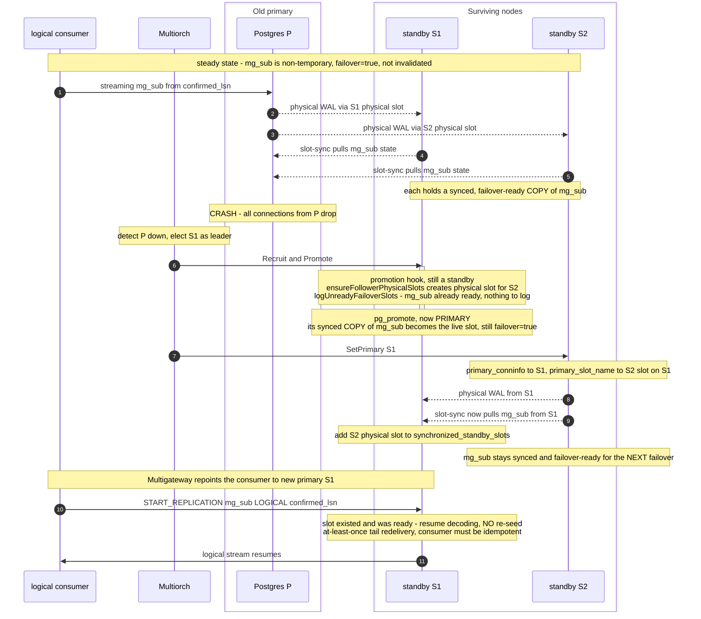

_Case 2 — the slot had not been synced yet._ If `P` crashes in the window **between shipping WAL (arrows 2–3)
and slot-sync's first successful pass (arrows 4–5)**, no standby holds a copy of `mg_sub` at all. Physical
replication carried the _data_ but never the _slot_ — slot state is not in the WAL stream (§1.6). The promoted
`S1` therefore has no `mg_sub`: the readiness check finds nothing to flag (an _absent_ slot is not counted as
"unready"), the consumer's `START_REPLICATION` fails, and the slot cannot be rebuilt after the fact — you
cannot create-then-rewind a slot to a past LSN, and the catalog rows needed to decode from the old LSN were
already vacuumed on the standby because no synced slot was pinning them. The consumer must re-seed.

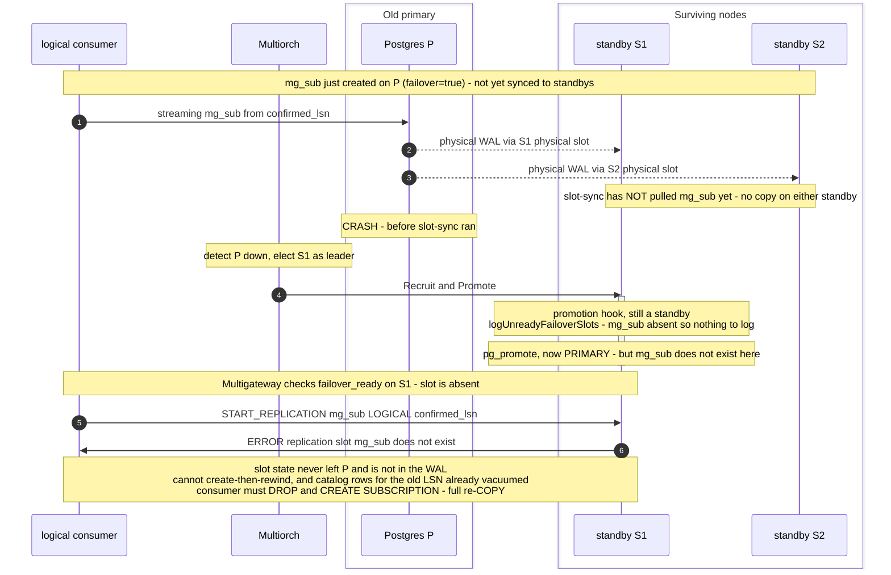

**The re-seed outcome belongs to Case 2 only.** Once `mg_sub` is `failover_ready` on the standbys, a primary
crash is survivable without a re-seed; the sole unrecoverable case is a crash before the slot's _first_ sync
completed. That is precisely the window `failover_ready` exists to flag — and why the gateway verifies
`failover_ready` on the new primary before repointing, degrading to a clean client-driven re-seed (§3.1.1)
rather than a silent gap.

### 3.2 Remove non-temporary slot guard

The gateway currently _rejects_ every non-temporary slot outright, precisely because it could not carry one
across a failover (the guard this design removes). The change is to relax the preamble
(`replication_preamble.go`) to reject only non-temporary slots that are _not_ registered for failover. The
persistent failover slots this admits are propagated to the standbys by native slot-sync (§2) and protected
across promotion by the failover-time readiness check (§3.1.2); a failover before a freshly created slot has
synced degrades to a client-driven re-seed (§3.1.1), never a silent gap (§4.4).

The sticky per-backend reservation (`protoutil.ReasonLogicalReplication`) is deliberately left unchanged here.
A live walsender stream is physically one backend, and on the client-driven path (§3.1.1) it tears down on
failover and the consumer reconnects to the new primary with a fresh reservation — so nothing needs to be
tracked shard-wide for the feature to work. Un-pinning the reservation so a stream can be _carried_ across a
promotion without teardown is only needed for the transparent repoint, and is deferred to that step (§3.1.2).
The SQL-function path (`pg_create_logical_replication_slot` on an ordinary connection) is admitted by the
planner too, but only for a call that spells out a literal `failover=true` itself — it is not auto-marked
(see §3.2.1's "Boundaries of the rewrite" for why the two forms differ).

Admitting these slots is gated behind a dynamic Multigateway flag, `enable-slot-based-replication` (default
off, mirroring the Multipooler flag of the same name and read live so it is reloadable). With the flag off the
preamble rejects every non-temporary slot exactly as it does today, so the guard change is inert until an
operator enables the feature. Physical (non-logical) slots stay rejected regardless of the flag.

### 3.2.1 Auto-marking non-temporary slots as failover slots

Relaxing the guard to admit slots _registered_ for failover still leaves HA opt-in per client: a subscriber
that runs a plain `CREATE SUBSCRIPTION` (without `WITH (failover = true)`) creates a non-temporary logical slot
with no `FAILOVER` option, which the relaxed guard would still reject. An operator who enabled slot-based
replication for the whole cluster therefore silently loses HA — and the slot entirely — for every such
subscriber. Auto-marking closes that gap: with the flag on, a non-temporary logical `CREATE_REPLICATION_SLOT`
that omits `FAILOVER` is no longer rejected but **rewritten** to inject it (`FAILOVER` is inserted as the first
option, or a fresh `(FAILOVER)` list is appended), so the slot is _born_ `failover = true` without any client
change. The command reply shape is unchanged, so the subscriber still works unmodified; the gateway also emits
an advisory `NOTICE` on the rewrite so the auto-marking is observable (in a PostgreSQL subscriber's server log
via its notice processor, or in any client's notice handler). This is the sole reliable moment to set the flag:
`pg_alter_replication_slot` / `ALTER_REPLICATION_SLOT` requires acquiring the slot, so an already-streaming slot
cannot be altered — creation is the one point at which the slot is inactive.

The rewrite is safe because PostgreSQL never resets a slot's `failover` on its own: `walrcv_alter_slot` has a
single backend caller (`AlterSubscription`, on an explicit `ALTER SUBSCRIPTION ... SET (failover=…)`); the apply
worker, tablesync, reconnect, and `REFRESH` never touch it, and the slot-sync worker syncs purely on the slot's
`failover` column. So the intended mismatch — slot `failover = true` while the subscription's `subfailover =
false` — is stable. A slot's persistency is likewise immutable (`ReplicationSlotAlter` only changes
`failover`/`two_phase`), so a client cannot demote an auto-marked slot to temporary to escape sync.

Because the only post-creation route to a slot's `failover` flag is the `ALTER_REPLICATION_SLOT` replication
command (there is no `pg_alter_replication_slot` SQL function), the gateway also **refuses an
`ALTER_REPLICATION_SLOT` that sets `FAILOVER` to false** while the feature is on — the command an explicit
`ALTER SUBSCRIPTION ... SET (failover = false)` emits. This keeps an auto-marked slot registered for failover:
a client cannot silently opt back out and lose HA behind the "single server" abstraction. Enabling failover, or
altering only `TWO_PHASE`, is relayed unchanged; with the feature off the command is not inspected at all.

Boundaries of the rewrite:

- **Command form only.** Auto-marking applies to the walsender `CREATE_REPLICATION_SLOT` command — the form a
  real subscriber sends, which never passes through the planner — and is patched as text
  (`rewriteCreateReplicationSlotAddFailover`), since its grammar is fixed and small enough to tokenize safely.
  Only a genuinely omitted `FAILOVER` option is injected; an explicit `FAILOVER false` is never touched (see
  the opt-out bullet below).
- **The SQL-function form requires an explicit `failover=true`.** `pg_create_logical_replication_slot(...)` on
  an ordinary connection is admitted by the planner only when the call spells the argument out
  (`rejectNonTemporaryReplicationSlot`); an omitted one is rejected exactly as it is with the feature off.
  Auto-marking it was tried and removed deliberately: making admission conditional on a rewrite that some
  later code path must remember to perform turns a single predicate into a two-step invariant, and the planner
  has roughly eight independent plan-construction paths (`planDefault`/`routePrimitive`, `planSelectStmt`,
  `planCopyStmt`, `planHoldCursorDeclare`, `planTempTableCreation`, `planExecuteStmt`,
  `tryUnwrapWrappedExecute`, and the portal path) that each had to uphold it — several silently did not. Worse,
  the promise freezes into anything PostgreSQL stores and re-invokes later (a view body, a column `DEFAULT`, a
  `CHECK` constraint), where the flag can never be re-checked. Requiring the client to be explicit keeps what
  Postgres runs identical to what the client wrote.
- **Explicit opt-out honored.** An explicit `FAILOVER false` is a deliberate client choice and stays rejected
  (it never appears in a real subscriber command — the walreceiver omits the option when false rather than
  emitting `FAILOVER false`).
- **No retroactive sweep.** Slots created before the flag was enabled are not marked; they pick up the flag only
  when recreated.

## Part 4. Changes to Multipooler

The pooler owns the slot lifecycle on PostgreSQL — the gateway cannot create, drop, or query slots itself.
Net-new operations, run as admin SQL through the pooler's existing superuser path (as `pg_promote()` / `ALTER
SYSTEM` are today):

### 4.1 Slot operations

The rest of the design keeps needing to do one of two things to a slot: create the failover slot on the
primary, and read a slot's failover-readiness before trusting a node as a target. So the manager exposes
`EnsureLogicalSlot(name, plugin, failover)` → `pg_create_logical_replication_slot(...)` (idempotent);
`DropLogicalSlot` for cleanup; and `GetSlotState` → a `pg_replication_slots` row (`failover_ready`,
`invalidation_reason`, `catalog_xmin`). It does **not** advance slots: native sync keeps the standbys' slots
caught up on its own, and at the repoint the consumer's `START_REPLICATION ... <lsn>` positions the stream.

### 4.2 Driven on shard events

Because a slot cannot be created after the fact and rewound, the failover logical slot must exist on the
primary _before_ any change the consumer will replay — so it is ensured up front (with `failover = true`) when
a persistent slot is first requested, not at failover time. Native sync then propagates it to the standbys
automatically; Multigres never creates logical slots on standbys, it only verifies they have reached
failover-ready before trusting one as a promotion target (hook the recruit / `SetPrimary` paths).

### 4.3 Slot naming

The primary creates the physical slot and the follower sets its `primary_slot_name` to match, so each must
compute the same name independently. The slot name needs to be unique within the cluster, but does not need to
be unique compared to other clusters.

We derive the slot name from the follower's component `name`, which is already unique cluster-wide. Hence it
stays unique on the primary even when standbys span cells, and no cell qualifier is needed.

The name is sanitized to PostgreSQL's slot-name rules (`[a-z0-9_]`, ≤63 characters — see §1.5) and given a
`mg_` prefix (the short prefix Multigres already uses for its own identifiers, e.g. metrics) so they cannot
collide with a client-created slot of the same name. A slot name cannot be schema-qualified, so the prefix is
the flat-identifier equivalent of the `multigres` schema that namespaces Multigres-owned objects elsewhere.
The name is lower-cased unconditionally so the slot name is well-formed whether or not `name` can contain
upper-case letters, and `-` is mapped to `_`.

This transform must stay collision-free: underscores are already disallowed in `name`, so if `name` is limited
to lower-case `[a-z0-9-]` the lower-casing is a no-op and `-`→`_` is injective, needing no disambiguator; if
upper-case or other characters are possible, lower-casing (or folding them out) can collapse two distinct
names onto the same slot name, so append a short deterministic hash to preserve uniqueness.

### 4.4 Durability without a creation barrier

Creating the failover slot on the primary (§4.2) makes it exist there, but slot state is not in the WAL
(§1.6): for a window the slot exists _only_ on the primary, until the slot-sync worker copies it to the
standbys. A primary crash inside that window leaves no standby with a copy and forces the consumer to re-seed
(the Case-2 failure in §3.1.2). It is tempting to close that window the way Multigres closes the equivalent
window for writes — refuse to acknowledge the client's `CREATE_REPLICATION_SLOT` until the slot is
`failover_ready` on the standbys the write-durability policy requires. Such an ack-hold barrier was built and
then removed, because it cannot deliver the guarantee it promises. This section records why, and what
durability actually rests on instead.

**Why an ack-hold cannot make creation durable.** A fresh slot's `catalog_xmin` is frozen at its creation
point and only advances **when the slot is consumed** (the consumer streams, applies, and flushes its position
back). Slot-sync refuses to persist a synced slot whose `catalog_xmin` is _behind_ the standby's catalog
horizon — doing so "could lead to data loss," since the standby has already vacuumed past the rows the slot
would need. Meanwhile an idle standby's horizon creeps forward on its own (periodic running-xacts snapshots).
So a brand-new, unconsumed slot is precisely the one slot-sync will _not_ persist, and holding the creation
acknowledgement blocks the consumption that is the only thing that would make it persistable — a deadlock. Two
scenarios make the trap concrete:

- **`CREATE_REPLICATION_SLOT`, then a crash, nothing consumed.** The slot exists on the primary but was never
  streamed. We cannot _resume_ it on the promoted standby: a reconstructed slot lands at "now" (§1.6,
  can't-create-then-rewind), while the subscriber's origin and initial `COPY` sit at the slot's
  `consistent_point`; resuming would silently skip `[consistent_point, now)`, leaving the already-copied tables
  permanently inconsistent — worse than no slot. What _is_ safe is a **re-seed**: nothing was consumed, so
  re-`COPY`ing from the new primary (which holds all committed data via physical replication) loses nothing. A
  creation barrier adds nothing here — the safe outcome is a re-seed either way.
- **`CREATE_REPLICATION_SLOT`, then `START_REPLICATION`.** Once streaming begins the slot _can_ sync — flushing
  advances `catalog_xmin` until it overtakes the standby's horizon and slot-sync persists it. But there is
  nothing to hold: the "acknowledgement" that opens the stream is the `CopyBothResponse`, and syncing requires
  the stream to flow (receive → apply → flush). Holding it, or buffering `XLogData`, starves the very flushing
  that produces the sync — the same deadlock, moved. Logical replication also has **no server→client durability
  acknowledgement** to hang a barrier on: the subscriber flushes _its own_ position upstream; the publisher
  never signals "your position is now failover-safe."

**The reframe: this is an avoid-re-`COPY` optimization, not data-loss prevention.** A clean re-seed never
loses committed data for a table-replica subscriber — the re-`COPY` reconstructs correct current state from
the new primary. So the whole feature is an optimization to avoid the expensive re-`COPY` (and, for CDC-style
consumers, to preserve intermediate change-event granularity), _not_ a data-loss-prevention mechanism. The
only true silent-loss risk in the space is the reconstruct-at-now-and-resume of the first scenario, which
Multigres must **never** do. Given that, native slot-sync (during streaming) plus a client-driven re-seed
(§3.1.1) for the pre-sync window already deliver "no committed data loss," and "usually no re-`COPY` either."
An ack-hold would only add latency and, on an idle shard, deadlock but for a degrade that made it inert
anyway.

**What durability rests on, then.** `CREATE_REPLICATION_SLOT` (and the plain-SQL
`pg_create_logical_replication_slot(...)` form) relays byte-blind and returns immediately, exactly as a
temporary slot does today. The slot then becomes durable the way PostgreSQL intends: the subscriber streams,
the slot's `catalog_xmin` advances, slot-sync persists it onto the standbys shortly after, and §2's machinery
(physical slots, `hot_standby_feedback`, `sync_replication_slots`, `synchronized_standby_slots`) keeps it WAL-
and catalog-retained continuously. For the window before that first sync completes, a failover degrades to a
clean client-driven re-seed (§3.1.1) — safe, occasionally costing a re-`COPY`. Slot-aware leader appointment
(Part 5 #11) then prefers a `failover_ready` candidate among WAL-equal nodes, so once a slot has synced a
promotion lands, whenever possible, on a node that can serve it without a re-seed. The failover-time readiness
check (§3.1.2) is what keeps the pre-sync window from ever becoming a _silent_ gap: it flags an absent or
not-ready slot on the new primary and re-seeds rather than resuming into it.

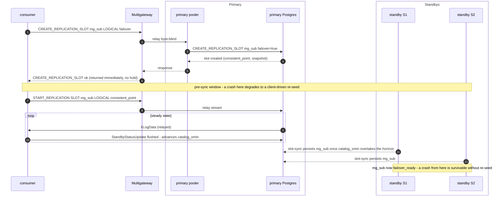

#### 4.4.1 When data can actually be lost

It helps to separate three things that all get called "data loss," because only one of them is caused by this
feature:

- **Committed rows gone from the database** — the classic async-failover tail-loss window: the old primary
  commits past what it shipped, and the promoted standby never received it. This **does not apply to
  Multigres**, which always runs synchronous replication — a commit is not acknowledged until the durability
  policy's standbys have it, and `synchronized_standby_slots` additionally holds a logical consumer back to what
  those standbys have flushed — so a committed transaction (and a consumer's confirmed position) can never
  outrun the promotion target. It is a real window only for an asynchronous PostgreSQL deployment.
- **A silent subscriber gap** — the database on the new primary still holds every committed row, but the
  subscriber silently skips a range. This is the _only_ slot-related loss, and it is **mistake-triggered**: it
  happens only if the subscriber _resumes_ across a window where the slot's decode context is not yet durably
  established on the promotion target. Multigres never resumes there — the failover-readiness check (§3.1.2)
  refuses and re-seeds instead. The MSCs below are what that guard protects against.
- **Re-seed cost** — a re-`COPY` loses no committed data for a table-replica subscriber; for a CDC/event
  subscriber it loses intermediate change granularity. This is the price of the pre-sync window, not
  committed-data loss.

The silent-gap window has two shapes.

**Resuming before the slot has synced.** The slot exists only on the primary; a crash leaves the promotion
target without it. Reconstructing it there lands at "now" and resuming skips everything the subscriber had
already copied but not yet consumed — a silent, permanent gap. A re-seed is always safe here.

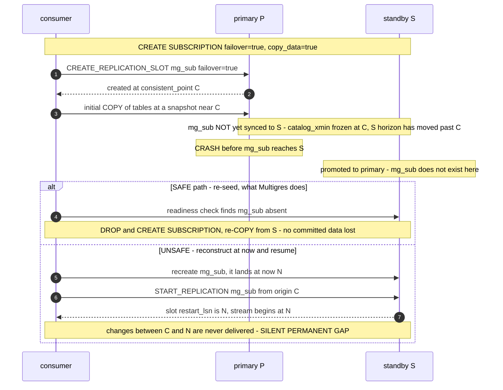

**Failover during initial table sync.** The apply worker's failover slot may itself have synced, but the
per-table `tablesync` workers use _temporary_ slots that never fail over, and the tables sit at mixed,
incomplete positions. The subscription is not in a consistent, resumable state, so a resume can permanently
miss the changes carried by a lost `tablesync` slot. A re-seed restarts `tablesync` cleanly.

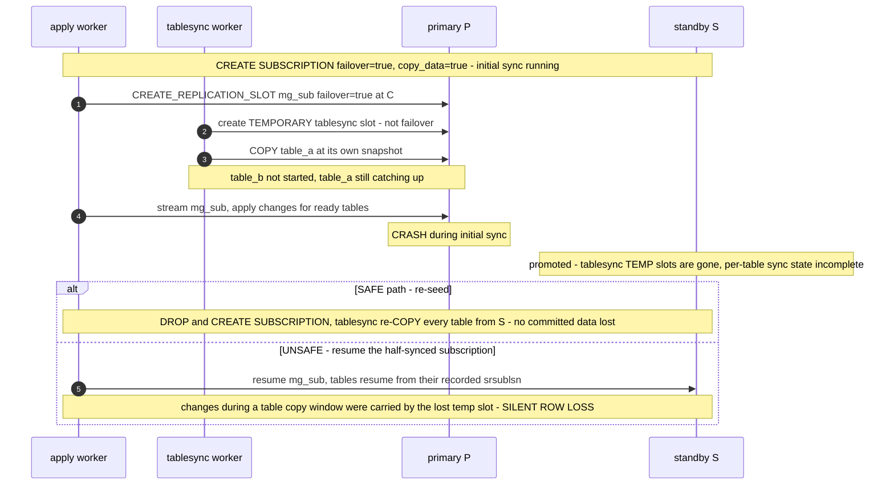

**The safe boundary.** Once initial sync is complete _and_ `mg_sub` is `failover_ready` on the required
standbys, a crash is survivable with a plain resume — no re-seed, at-least-once tail redelivery. The two
conditions are not merely "the apply worker has run for a while": reaching `failover_ready` needs
_consumption_ to advance `catalog_xmin` past each standby's horizon plus one slot-sync cycle, so on an idle
shard with no change traffic the slot may never become ready no matter how long it sits. And the boundary is
the slot-sync worker actually _persisting_ the slot (step 2 in the MSC), not `catalog_xmin` merely catching
up: a crash after the slot becomes syncable but before the worker's next run — its nap is adaptive, roughly
200 ms to 30 s — still finds the slot absent on the standby and forces a re-seed, exactly as in the first
shape above.

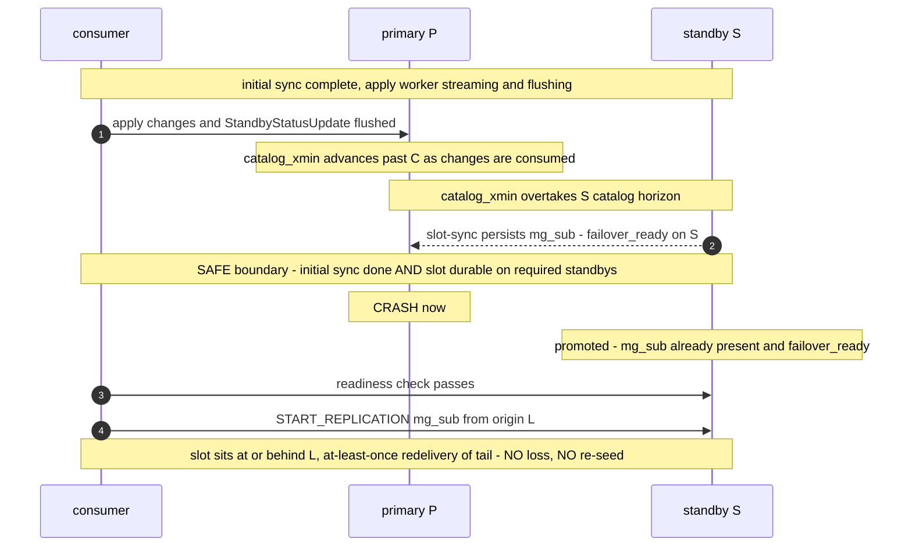

#### 4.4.2 Operational note: making a new subscription failover-safe

The failover machinery only protects a subscription **after its first slot-sync has persisted `mg_sub` on the
required standbys** (the safe boundary above). A newly created subscription is therefore _not_ failover-safe for a
window after `CREATE SUBSCRIPTION`, and on an idle shard it may never become safe on its own. This is a normal,
expected state — not a bug — but it must be operated deliberately.

**When a new subscription is not yet protected.** From `CREATE SUBSCRIPTION` (which issues
`CREATE_REPLICATION_SLOT ... failover=true`) until _both_ (a) the initial table sync has finished and (b) `mg_sub`
is `failover_ready` and persisted on the durability-policy standbys. Two things extend this window (§4.4.1): the
per-table `tablesync` workers use temporary slots that never fail over, so an incomplete initial sync is unsafe
regardless of `mg_sub`; and `failover_ready` needs _consumption_ to advance `catalog_xmin` past each standby's
horizon plus one slot-sync cycle, so **on an idle shard with no change traffic the slot can sit not-ready
indefinitely**.

**How to recover if a failover lands in the window.** The promotion target has no usable slot. The gateway's
failover-readiness check (§3.1.2) detects the absent / not-ready slot and **refuses to resume** — it never
resumes into a silent gap (§4.4.1). Recovery is a **client-driven re-seed**:

```sql
DROP SUBSCRIPTION sub;
CREATE SUBSCRIPTION sub CONNECTION '...' PUBLICATION pub WITH (copy_data = true, failover = true);
```

A consumer behind the Multigateway is degraded to this automatically; a raw consumer that manages its own
subscription must issue the `DROP` / `CREATE` itself. No committed data is lost for a table-replica subscriber —
the re-`COPY` reconstructs current state from the new primary — but a CDC / event consumer loses the intermediate
change granularity in the gap (§4.4.1).

**How to reach the safe boundary deliberately (the workaround for the idle-shard case).** To make a fresh
subscription failover-safe rather than waiting and hoping:

1. **Let the initial sync finish.** Confirm every table is in the ready state — `srsubstate = 'r'` in
   `pg_subscription_rel` — before relying on failover; the `tablesync` temporary slots must be gone.
2. **Drive change traffic.** `catalog_xmin` only advances as changes are consumed, so on a quiet shard generate
   some write traffic (any trivial write, or a periodic keepalive) so the slot becomes syncable.
3. **Optionally force a sync cycle** on each standby instead of waiting out the worker's adaptive nap
   (~200 ms–30 s): `SELECT pg_sync_replication_slots();`.
4. **Verify readiness** on each durability-policy standby before treating the subscription as HA-safe:

   ```sql
   SELECT slot_name,
          (synced AND NOT temporary AND invalidation_reason IS NULL) AS failover_ready
     FROM pg_replication_slots
    WHERE slot_name = 'mg_sub';
   ```

   Until this returns `failover_ready = true` on the required standbys, treat a failover as a re-seed.

---

## Part 5. Caveats and considerations

1. **Can't create-then-rewind (§4.2).** Followers' slots must be pre-created and kept caught up _before_ the
   changes they'll replay. Lazily creating a slot on the new primary at failover time and rewinding it is
   impossible. Native slot sync satisfies this by creating the slot on the primary and propagating it to every
   standby ahead of any promotion; there is no lightweight create-at-failover shortcut.
2. **Catalog-row invalidation (§1.4).** If `catalog_xmin` isn't durably held, a follower's synced slot is
   silently invalidated and useless at promotion. Native sync keeps the hold durable through
   `hot_standby_feedback` plus the physical replication slot — reversing Multigres's current slot-less posture,
   and the reason both are mandatory.
3. **Async tail-loss.** In an asynchronous deployment a failover can lose the last δ of WAL the old primary had,
   and resuming at `confirmed_lsn` could leave the subscriber ahead of the new primary's surviving data —
   persistent slots don't change that. Multigres closes this window at the source: it always runs synchronous
   replication (a commit is not acknowledged until the durability policy's standbys have it) plus
   `synchronized_standby_slots` (which holds the logical consumer back to what those standbys have flushed), so
   committed data is always on the promotion target and the subscriber can never be ahead of it. The
   failover-repoint guard (§3.1.2) is the backstop that would still _detect_ (not _recover_) such a gap were
   synchronous replication ever disabled.
4. **Breaking protocol-blindness.** The LSN tap makes the gateway parse a sub-protocol it deliberately never
   interpreted (§3.1). Risks: parser bugs on adversarial/streaming-framed input, hot-path performance, coupling
   to protocol versions. Mitigation: opt-in tap only, incremental parsing, decode-failure ⇒ teardown.
5. **Transparent failover is not durable across a gateway crash.** The tap's confirmed LSN lives only in gateway
   memory — there is no durable Multigres-side resume record. If the gateway itself fails, that position is lost
   and the single-connection experience (§3.1.2) cannot be preserved: recovery degrades to the client-driven path
   (§3.1.1), where the consumer notices the dropped stream and reconnects at its _own_ durably-tracked LSN (a
   replication origin or `pg_recvlogical` flush file, §1.2), which the synced slot on the new primary can still
   serve. Correctness is preserved — the consumer, not the gateway, is the source of truth — but transparency is
   best-effort. And because the confirmed LSN always lags the client's true position, resume is at-least-once
   regardless of who drives it, so consumers must be idempotent.
6. **Idle/lagging follower slots pin resources.** Every pre-created follower slot holds `restart_lsn` +
   `catalog_xmin`; if it is not advanced, WAL and catalog rows bloat on that node. Native sync advances synced
   slots automatically, clamped to each standby's replay LSN. They also draw on `max_replication_slots` (template
   default 25) alongside physical and client slots — a fan-out budget concern.
7. **`synchronized_standby_slots` can stall the primary.** Used for tail-loss safety, a listed-but-down follower
   blocks logical decoding on the primary until removed. Membership churn (recruit/leave) must update the list
   promptly, or a dead follower freezes all logical replication.
8. **Subscriber repoint semantics.** Native semantics require the downstream `ALTER SUBSCRIPTION ... CONNECTION`.
   In the Multigres model the client connects _to the gateway_, so the gateway can hide the repoint for stream
   continuity — but if the client is a full PostgreSQL subscriber with its own origin bookkeeping, its LSN
   expectations and ours must agree, or resume is rejected.
9. **Multi-shard / routing assumptions.** The relay pins one shard/leader (`DefaultTableGroup`/`DefaultShard`,
   `MODE_WRITABLE`). Failover repoint must re-resolve the leader for exactly that shard and not silently rebind;
   interaction with the buffering path (which replication currently bypasses) needs deliberate handling.
10. **Security / trust boundary.** Parsing bytes from a client replication stream and issuing slot-management SQL
    derived from client-named slots crosses a trust boundary. Slot names/LSNs from the wire must be validated;
    slot-management SQL must use the existing quoting/`InternalQueryService` path, never string interpolation.
11. **Leader appointment is slot-aware (was slot-blind).** Multiorch's `AppointLeader` picks the new primary by
    WAL position — the most-advanced viable candidate — which alone is _slot-blind_: a candidate can be ahead on
    WAL yet carry a temporary (not-yet-persisted) or invalidated slot, and promoting it forces the subscriber into
    a re-seed even when a WAL-equal candidate could have served the slot (§4.4). This is now handled as a
    **tiebreak among WAL-equal candidates**: each pooler reports its failover-slot readiness
    (`failover_slots_ready` / `_total`, computed only when slot-based replication is on) in its health snapshot,
    and `poolerHealthStateLess` prefers the candidate with more failover-ready slots once WAL position and the
    resign signal are tied. Because it only reorders the already-WAL-tied `EligibleLeaders`, it never trades data
    safety (WAL position always wins) or a resign intent for slot readiness; when no WAL-viable candidate is
    slot-ready, the WAL-best node is still promoted and the subscriber re-seeds. Slot-aware appointment is what
    keeps a promotion landing, whenever possible, on a node that can serve the durable slot without a re-seed.

---

## Recommendation

Adopt native PostgreSQL 17 slot sync (Part 2), built on the Multigateway and Multipooler machinery (Parts 3
and 4). Native sync enforces the WAL-retention and catalog-safety guarantees that are otherwise easy to get
subtly wrong (silent data loss), and its Multigres-side cost is bounded and concrete: add `dbname` to
`primary_conninfo`, set `hot_standby_feedback` / `sync_replication_slots` in the template, and introduce
per-follower physical replication slots plus `synchronized_standby_slots` — reversing Multigres's current
slot-less posture, which is the one significant architectural change. The gateway owns only what PostgreSQL
cannot: carrying the consumer's stream across a promotion (the LSN tap and failover repoint, §3.1.2) and
lifting the non-temporary-slot guard (§3.2). The fully-DIY alternative (Appendix A) is documented but not
recommended — it reimplements the catalog-safety native sync provides for free and accepts a documented
silent-data-loss risk — and should be revisited only if reintroducing physical replication slots is rejected.

---

## Implementation order

Each step below is a single pull request, merged in the order given, and must not break anything already
merged. That is possible because no step depends on a later one: every step is either dormant (new code
nothing calls yet), an inert configuration change, or strictly additive. The feature first works end-to-end at
step 5; steps 1–4 are foundations that change nothing a client can observe, and step 6 is the optional
transparency layer. There is deliberately no creation-time durability-barrier step: a barrier that holds the
`CREATE_REPLICATION_SLOT` acknowledgement until the slot is durable was considered and rejected (§4.4) — it
cannot deliver that guarantee, and durability rests on slot-sync during streaming plus a client-driven re-seed
for the pre-sync window instead.

1. **Slot primitives and naming (§4.1, §4.3).** Add the manager operations `EnsureLogicalSlot`,
   `DropLogicalSlot`, and `GetSlotState`, plus the deterministic slot-name helper. Nothing calls them yet, so
   this is new, unit-testable surface with no runtime behavior change.

2. **Inert node configuration (part of §2.1).** Set `wal_level = logical`, add a valid `dbname` to
   `primary_conninfo`, and size `max_wal_senders` / `max_replication_slots` for the fan-out. Each is inert on its
   own — `wal_level = logical` only widens what the WAL records, `dbname` is ignored by streaming replication,
   and the limits are pure capacity — so replication continues exactly as today (still slot-less).
   `primary_slot_name` is deliberately left unset until step 3.

3. **Physical replication slots and their lifecycle (rest of §2.1, §2.2–§2.5).** Turn on `hot_standby_feedback`
   and `sync_replication_slots`, and introduce the per-follower physical slot: the current primary creates a slot
   (named by the step-1 helper) for each follower and maintains `synchronized_standby_slots`, while each standby
   sets `primary_slot_name` to its own slot — wired into the promote, demote, add-standby, and remove-standby
   paths (hook recruit / `SetPrimary`). This is the one change to existing plumbing (slot-less → slot-based
   physical replication), so it must create the slot on the primary before the standby points at it, and is best
   gated behind a flag for rollout. It touches only physical replication, not the client path, and
   `sync_replication_slots` has nothing to sync yet. Deliverable on its own: standbys hold WAL and catalog rows
   through a durable slot (§1.5) rather than best-effort `wal_keep_size`.

4. **Failover-slot handling on the primary (§4.2, §2.2).** When a persistent slot is requested, ensure it exists
   on the primary with `failover = true`, and verify standbys reach failover-ready before trusting one as a
   promotion target. Still invisible end-to-end, because the gateway guard (step 5) has not yet let any client
   create a persistent failover slot, and existing temporary-slot streams are untouched.

5. **Lift the non-temporary slot guard (§3.2).** Relax the preamble to admit non-temporary failover slots (still
   rejecting non-temporary, non-failover slots), gated behind the dynamic Multigateway flag
   `enable-slot-based-replication` (default off). This is the activation step: temporary slots keep working
   unchanged, and a client can now create a persistent failover slot that steps 3–4 keep synced and catalog-safe.
   The feature works end-to-end here via the client-driven path (§3.1.1) — on failover the consumer reconnects
   and resumes on the new primary — with no gateway relay changes.

6. **Gateway tap and transparent repoint (§3.1.2).** Add the opt-in LSN-aware tap and the repoint that carries
   the stream to the new primary under the same connection. This is also where the sticky per-backend reservation
   (`ReasonLogicalReplication`) is relaxed so a stream can move to the new primary's backend without teardown —
   the client-driven path (step 5) needs no such change because it reconnects fresh. It is strictly additive and
   opt-in (persistent failover slots only; temporary slots keep the byte-blind fast path; any decode failure
   falls back to teardown), so deferring it — or hitting a decode bug — simply degrades to the client-driven
   failover from step 5. This is the "looks like a single server" layer and ships last.

---

## Appendix A — Considered alternative: fully-DIY catch-up (Patroni model)

Also uses all of Parts 3 and 4, but **replaces native sync**: Multigres owns the follower slots itself. Choose
this only if reintroducing physical replication slots (Part 2) is rejected.

The key insight that shapes this proposal: a follower slot only needs to be _positioned_ at the client's exact
resume LSN **once, at repoint** (§3.1.2) — not continuously. During normal operation Multigres does **not**
track the client's LSN into every follower slot; it only keeps the slots _pre-created, valid, and coarsely
bounded_. The precise advance is a failover-time action.

What it entails:

1. **Pre-created, un-synced follower slots.** Each follower has its own persistent logical slot (created via
   `EnsureLogicalSlot`, §4.1, with `failover => false` — nothing syncs them). They must exist before any change
   the client might replay (§1.6); they are _not_ kept at the client's position.
2. **Keep slots valid continuously (the unavoidable part).** `hot_standby_feedback = on` on every follower, so
   the primary holds `catalog_xmin` back and its vacuum WAL doesn't invalidate the idle follower slots on replay
   (recovery-conflict invalidation). This hold is only durable _while connected_; a brief follower disconnect
   drops it and the next vacuum-replay can invalidate the slot — exactly the fragility a physical slot would
   remove, and the reason this path is riskier than native sync (Part 2).
3. **Coarse, periodic advance to bound bloat (retention hygiene, not client tracking).** An idle slot parked at
   its creation LSN pins `catalog_xmin`/`restart_lsn` there forever → unbounded WAL/catalog bloat (caveat #6). A
   lazy manager loop advances each follower slot forward to a _recent safe bound_ (well behind the client — just
   enough to release old WAL/catalog), gated by the step-4 safety check below. This is coarse and infrequent,
   unlike a tight per-confirmation loop.
4. **Precise positioning at repoint (§3.1.2), gated by a hand-rolled `catalog_xmin` safety check (the
   load-bearing part).** On failover the gateway advances the new primary's slot to the persisted `confirmed_lsn`
   `X` via `AdvanceLogicalSlot` (forward-only, clamped to the node's replay LSN), then resumes. Before _any_
   advance (this one and the coarse ones in step 3), verify the node still holds the catalog rows needed to
   decode from the target — the Patroni rule: the relevant `catalog_xmin` is non-null and not newer than the
   target. Advancing past retained catalog rows is the documented **silent-data-loss** failure: the slot would
   claim changes were consumed that the node never actually had.
5. **No `synchronized_standby_slots`.** Without it, nothing stops the subscriber from getting ahead of a
   follower, so the async tail-loss window is wider and must be handled purely by the failover-repoint guard
   (§3.1.2, detect-and-refuse) or by synchronous replication.

**Trade-off vs. native sync (Part 2):** avoids reintroducing physical slots (preserves Multigres's current
slot-less disk-safety posture), and deferring precise positioning to repoint means only a coarse
bloat-bounding loop runs in steady state — cheaper than continuously syncing exact positions. But Multigres
must still run the continuous liveness machinery (steps 2–3) and correctly reimplement the catalog-safety
check (step 4) that native sync enforces for free, and it accepts a larger tail-loss window and the
silent-data-loss risk if the safety check is wrong. Strictly more code and more risk than native sync;
documented here so the cost of "no physical slots" is explicit.

**DIY-specific problems.** These are absent from Part 5 because they exist only under this alternative — they
are the failure modes native sync removes:

- **Fragile catalog hold** (step 2): the `catalog_xmin` hold rests on `hot_standby_feedback` alone. A brief
  follower disconnect drops it, and the next vacuum-replay can invalidate the slot — the disconnect-window,
  timing-skew, and recovery-conflict failures the physical replication slot would prevent.
- **Silent data loss on a wrong advance** (step 4): the hand-rolled `catalog_xmin` safety check is load-bearing.
  Advancing a slot past the catalog rows the node still holds silently claims changes were consumed that the
  node never had.
- **Wider tail-loss window** (step 5): without `synchronized_standby_slots`, nothing holds the subscriber back
  from getting ahead of a follower, so the async tail-loss window is larger and rests entirely on the repoint
  guard or synchronous replication.

## Appendix B — Considered alternative: table-based slot sync with a custom materialization primitive

Like Appendix A, this is a **considered, unimplemented** alternative to native sync (Part 2), recorded for future
reference. It keeps native sync's _retention_ model but replaces its _transport_: instead of the standby's
slot-sync worker opening a SQL connection back to the primary (why native sync needs a `dbname` in
`primary_conninfo`), the slot metadata is replicated **forward** through a table, and a custom C primitive
materializes the slot on each standby. The motivation is removing the standby → primary back-connection.

### B.1 The missing primitive

There is no SQL way to create a logical slot at a _past_ position. `pg_create_logical_replication_slot()` always
starts the new slot at "now" (its `restart_lsn` / `catalog_xmin` are pinned at creation), and
`pg_replication_slot_advance()` is forward-only. You cannot create a slot and rewind it — a fresh slot only
begins pinning `catalog_xmin` from its creation point, so the historical catalog rows needed to decode from an
earlier LSN may already be gone (the can't-create-then-rewind invariant, Part 1). So plain SQL cannot reconstruct
on a standby a slot positioned where the primary's slot actually is.

### B.2 Writing the primitive as a C extension

The primitive is missing from _SQL_ because it is unsafe to expose casually — not because the machinery is
missing. The backend already does exactly this in `src/backend/replication/logical/slotsync.c`:
`synchronize_one_slot()` calls `ReplicationSlotCreate()`, stamps the copied `restart_lsn` / `confirmed_flush` /
`catalog_xmin` / `two_phase` onto `slot->data`, and persists with `ReplicationSlotMarkDirty()` /
`ReplicationSlotSave()` once it is safe. A C extension can expose the same, e.g.:

```text
mg_materialize_slot(name text, plugin text, restart_lsn pg_lsn, confirmed_flush pg_lsn,
                    catalog_xmin xid, two_phase bool, failover bool)
```

**Prior art:** EDB's `pg_failover_slots` extension did precisely this (an extension plus a background worker
recreating logical failover slots on standbys) for PG 11–15, before native sync landed in PG 16/17. So the
pattern is proven, and `supabase/postgres:17` already supports loading extensions.

### B.3 What the primitive does not remove

The primitive is the easy part. Materializing a slot at LSN `X` is only _valid_ if the node still holds the WAL
back to `restart_lsn` **and** the historical catalog rows to decode from `X` (`catalog_xmin`). The table
transport does not change that — it is the same envelope Part 2 relies on:

- **Catalog retention** still needs `hot_standby_feedback` plus a per-follower physical slot (the durable
  `catalog_xmin` hold), so replayed vacuum does not discard the rows the materialized slot needs.
- **Clamp to replay / persist-when-safe:** the standby must have replayed to at least `confirmed_flush` before
  the copy is real — the same gate native sync applies (keep the synced slot temporary until safe, then persist).
  Skipping it re-introduces silent data loss.

So the table + primitive replaces the **transport and the worker**, not the retention/safety requirements.

### B.4 Flow for adding a slot

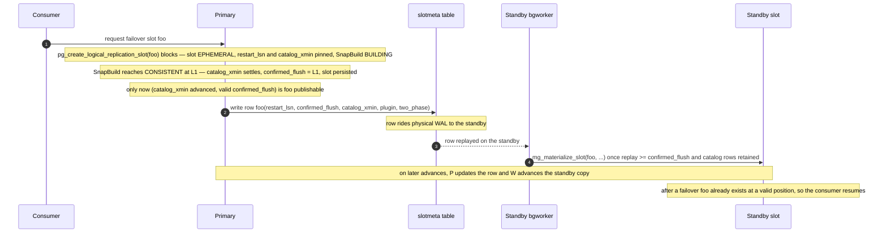

### B.5 The snapshot progression, and why a slot is published only after `catalog_xmin` has advanced

`pg_create_logical_replication_slot` does not finish instantly — it blocks while the snapshot builder
(`SnapBuild`) reaches a consistent point:

1. The slot is created **`RS_EPHEMERAL`** (dropped if the creating backend errors before it persists);
   `restart_lsn` is stamped and `catalog_xmin` is set to the oldest xid of the snapshot _still in progress_ (e.g.
   `xid 100`, protecting an open `Txn_A`). `confirmed_flush` is unset.
2. `SnapBuild` walks `xl_running_xacts`, waiting for the in-flight transactions to finish:
   `BUILDING → FULL_SNAPSHOT → CONSISTENT`.
3. At **`CONSISTENT`** (LSN `L1`) the slot gets `confirmed_flush = L1`, `catalog_xmin` settles to its final value
   (e.g. `100 → 140`), and the slot is **persisted**. Only then does the create call return.

"The xmin is inside a snapshot that has not yet finished" is exactly the pre-`CONSISTENT` window.

Publishing during that window is **not a stream-corruption problem** — worth stating, because the intuition that
"it seems fine" is largely right:

- The decoder **re-derives consistency** on use: a consumer connecting post-promotion restarts decoding from
  `restart_lsn`, rebuilds `SnapBuild`, and re-reaches the consistent point before emitting anything. It never
  emits pre-consistent changes.
- The provisional `catalog_xmin` is **over-retentive, never under** (`100` is older than the final `140`), so it
  pins a superset of the needed rows — safe, just wasteful.

The reasons to wait are **readiness**, not correctness:

1. **No resume point yet:** before `CONSISTENT` there is no `confirmed_flush`, so nothing a promoted standby could
   resume from.
2. **The slot is still ephemeral:** if creation does not complete, the primary drops it — and a standby that
   already materialized it holds an **orphan** of a slot that never persisted.
3. Minor: the provisional `catalog_xmin` pins extra catalog rows on every standby for the window.

So "publish only once `catalog_xmin` has advanced and the slot is persistent" is a **readiness gate**.

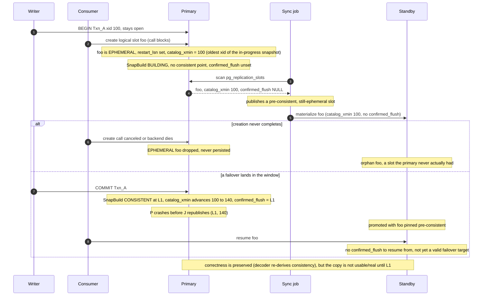

**Confirmed against PostgreSQL 17 (`REL_17_STABLE`).** In `pg_create_logical_replication_slot`
(`src/backend/replication/slotfuncs.c`) the slot is created `RS_EPHEMERAL`, the start point is found while
blocking, and it is persisted only at the end:

```c
ReplicationSlotCreate(name, true, temporary ? RS_TEMPORARY : RS_EPHEMERAL, two_phase, failover, false);
ctx = CreateInitDecodingContext(plugin, NIL, ...);
if (find_startpoint)
    DecodingContextFindStartpoint(ctx);   /* blocks until CONSISTENT */
if (!temporary)
    ReplicationSlotPersist();
```

`pg_get_replication_slots` (the view) filters only on `in_use`, with no persistency filter, so an ephemeral slot
mid-creation is shown, with `confirmed_flush_lsn` reported `NULL` while it is `InvalidXLogRecPtr`. And the
slot-sync worker fetches `... FROM pg_catalog.pg_replication_slots WHERE failover and NOT temporary` — an
ephemeral failover slot matches — then drops any fetched slot whose positions are still invalid:

```c
if ((XLogRecPtrIsInvalid(remote_slot->restart_lsn) ||
     XLogRecPtrIsInvalid(remote_slot->confirmed_lsn) ||
     !TransactionIdIsValid(remote_slot->catalog_xmin)) &&
    remote_slot->invalidated == RS_INVAL_NONE)
    pfree(remote_slot);   /* skip, retry next cycle */
```

with the comment that it has "fetched the remote_slot in its RS_EPHEMERAL state … sync it in the next sync cycle
when the remote_slot is persisted and has valid lsn(s) and xmin values." That is exactly the readiness gate this
scheme must reproduce.

### B.6 What the table transport buys

- **No standby → primary back-connection:** metadata flows forward on the stream that already exists; native
  sync's libpq fetch from the standby is gone.
- **Free ordering on physical WAL:** a "foo is at position X" row arrives on the standby exactly when it has
  replayed to where the row was written, so "standby has WAL ≥ published position" holds by construction — no
  clamp race.

### B.7 Costs, risks, and status

- **Unstable internal API:** `slot->data`, `ReplicationSlotCreate()`'s signature (gained `two_phase` in 16,
  `failover` in 17), and the persist path are backend internals — version-coupled, maintained across majors.
- **Re-deriving the safety checks:** the "replay ≥ `confirmed_flush`, catalog horizon safe, handle invalidation,
  skip while ephemeral" logic from `slotsync.c` must be reproduced or the scheme risks silent divergence.
- **ROI:** on a base image that already ships native sync, this only buys removing the back-connection — worth it
  only if that back-connection is a real deployment problem.

**Status:** not implemented. If pursued, the next step is a spike — prototype `mg_materialize_slot` against PG 17
to prove the internal-API path compiles and materializes a valid slot, plus a small standby bgworker that applies
the table rows, reusing Part 2's retention GUCs (`hot_standby_feedback`, per-follower physical slots) for
correctness.
