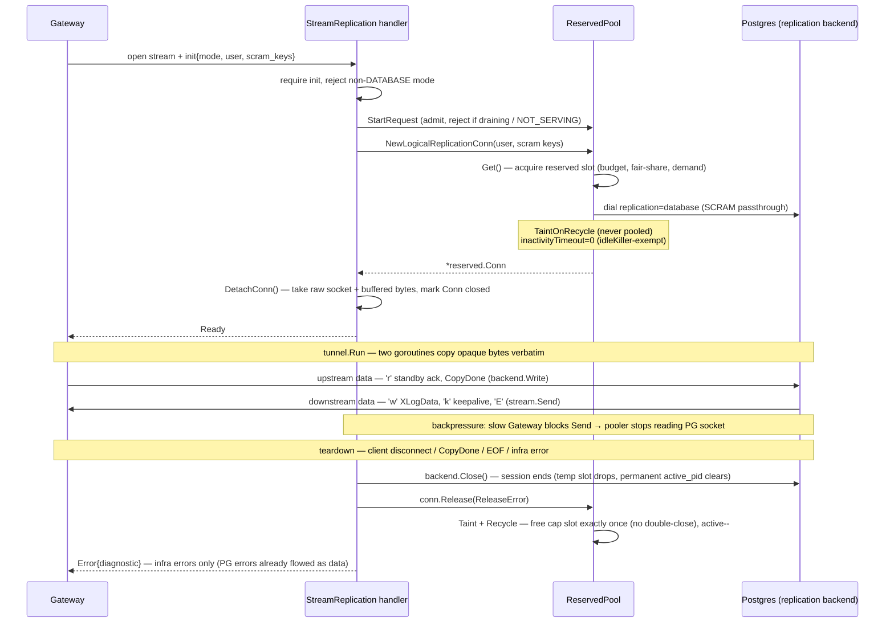

# Connection Pooling in Multigres

## Overview

Multigres implements a **per-user connection pooling** architecture in the
Multipooler service to efficiently manage PostgreSQL connections. Each user
gets their own dedicated connection pools that authenticate directly as that
user via trust/peer authentication. This design ensures strong security
isolation while supporting Row-Level Security (RLS) policies.

Pool capacities are managed dynamically using **fair share allocation** -- the
system distributes the global connection budget among active users based on
actual demand and automatically rebalances as users come and go.

## Architecture

<!-- markdownlint-disable MD013 -->

```text
┌──────────────────────────────────────────────────────────────────────────────────┐
│                           ConnectionPoolManager                                  │
│                                                                                  │
│  ┌──────────────┐                                                                │
│  │  AdminPool   │  (shared - postgres superuser)                                 │
│  │  AdminConn   │                                                                │
│  │  AdminConn   │                                                                │
│  └──────────────┘                                                                │
│                                                                                  │
│  ┌────────────────────────────────┐  ┌────────────────────────────────┐          │
│  │  FairShareAllocator (Regular)  │  │  FairShareAllocator (Reserved) │          │
│  │  Global Budget: 400 (80%)      │  │  Global Budget: 100 (20%)      │          │
│  └────────────────────────────────┘  └────────────────────────────────┘          │
│  Note: 80:20 split is at the GLOBAL level. Per-user pools scale independently   │
│  within these budgets based on demand (e.g., alice: regular=15, reserved=75).   │
│                                                                                  │
│  userPoolsSnapshot (atomic pointer - lock-free reads)                            │
│  ┌──────────────────────────────────────────────────────────────────────────┐    │
│  │  UserPool["alice"]                                                       │    │
│  │  ┌──────────────────┐   ┌──────────────────────────┐                     │    │
│  │  │   RegularPool    │   │      ReservedPool        │                     │    │
│  │  │   (user: alice)  │   │      (user: alice)       │                     │    │
│  │  │   Capacity: 0-400│   │      Capacity: 0-100     │                     │    │
│  │  │                  │   │ ┌─────────────────────┐  │                     │    │
│  │  │ RegularConn      │   │ │ internal RegularPool│  │                     │    │
│  │  │   └─ ConnState   │   │ └─────────────────────┘  │                     │    │
│  │  │      └─ Settings │   │ ReservedConn             │                     │    │
│  │  │      └─ Stmts    │   │   └─ ConnID              │                     │    │
│  │  └──────────────────┘   └──────────────────────────┘                     │    │
│  │  DemandTracker (regular)  DemandTracker (reserved)                       │    │
│  └──────────────────────────────────────────────────────────────────────────┘    │
│  ┌──────────────────────────────────────────────────────────────────────────┐    │
│  │  UserPool["bob"]                                                         │    │
│  │  ┌──────────────────┐   ┌──────────────────────────┐                     │    │
│  │  │   RegularPool    │   │      ReservedPool        │                     │    │
│  │  │   (user: bob)    │   │      (user: bob)         │                     │    │
│  │  │       ...        │   │          ...             │                     │    │
│  │  └──────────────────┘   └──────────────────────────┘                     │    │
│  └──────────────────────────────────────────────────────────────────────────┘    │
│                                                                                  │
│  Rebalancer goroutine (periodic: collect demand → allocate → apply → GC)        │
└──────────────────────────────────────────────────────────────────────────────────┘
```

<!-- markdownlint-enable MD013 -->

## Connection Pool Types

### 1. AdminPool (Shared)

**Purpose:** Control plane operations requiring superuser privileges.

**Characteristics:**

- Small pool size (default: 5 connections)
- Connects as PostgreSQL superuser (default: `postgres`)
- Shared across all users
- Used for privileged operations that user connections cannot perform

**Use Cases:**

- Authentication queries (e.g., password verification via `pg_authid`)
- Canceling long-running queries via `pg_terminate_backend()`
- Terminating connections when clients disconnect unexpectedly
- Killing timed-out reserved connections

### 2. UserPool (Per-User)

Each user gets their own `UserPool` containing both a RegularPool and ReservedPool.
Pools are created **lazily** on first connection request for that user. New pools
start with an initial capacity of 10 connections; the background rebalancer adjusts
capacities within seconds based on actual demand.

#### RegularPool

**Purpose:** Data plane connections for query execution with session state.

**Characteristics:**

- Authenticates directly as the user (trust/peer auth)
- Supports the Extended Query Protocol (Parse/Bind/Execute)
- Tracks connection state including settings and prepared statements
- Uses settings-based bucket routing for connection reuse

**Use Cases:**

- Simple queries without transactions
- Queries that can be executed on any available connection with matching settings

**Context Cancellation:**

RegularConn handles Go context cancellation by cancelling the backend query via
AdminPool's `pg_cancel_backend()`. The underlying protocol client always drains
messages until `ReadyForQuery` to keep connections clean. Connection-level errors
(read failures, broken pipes) cause the connection to be closed rather than
returned to the pool.

**Stale-Connection Retry:**

A pooled socket can be silently closed by PostgreSQL while it sits idle (idle
session timeout, server restart, etc.). The first write on that socket fails
with a connection-class error (EOF, EPIPE, FATAL 57P0x). The regular pool
recovers transparently in two places, both bounded by
`constants.MaxConnPoolRetryAttempts` attempts with `constants.ConnPoolRetryBackoff`
between them:

- `regular.Pool.GetWithSettings` retries when applying SETs hits a stale socket
  during acquisition (the underlying connpool closes the conn but does not
  retry on its own); each attempt dials a fresh replacement.
- `Conn.QueryWithRetry` / `QueryStreamingWithRetry` / `QueryArgsWithRetry`
  reconnect the same socket in place via `retryOnConnectionError` and re-run
  the op.

Together these cover both acquisition-time and execution-time stale-socket
failures for the non-reserved query path.

#### ReservedPool

**Purpose:** Long-lived connections for transactions and portal operations.

**Characteristics:**

- Fully encapsulates its own underlying RegularPool (completely separate from
  the main RegularPool)
- Authenticates directly as the user (trust/peer auth)
- Assigns unique connection IDs via atomic counter for client-side reference
- Maintains an `active map[int64]*Conn` for ID-based lookup
- Tracks reservation state via `reservedProps` (transaction or portal reservation)
- Includes background `idleKiller` goroutine for timed-out connections

**Use Cases:**

- Explicit transactions (`BEGIN`/`COMMIT`/`ROLLBACK`)
- Cursor operations requiring persistent portal state
- Any operation requiring connection affinity
- Unsafe connections (`multigres.unsafe_connection`), pinned to one backend for
  the session's life via the sticky `ReasonUnsafeConnection` reason

**Active-by-reason metrics:**

Every pin is a reservation _reason_ (`transaction`, `portal`, `temp_table`,
`copy`, `listen`, `logical_replication`, `session_advisory_lock`, `set_seed`,
`unsafe_connection`). Two gauges track active reserved connections:

| Metric                                  | Type  | Meaning                                         |
| --------------------------------------- | ----- | ----------------------------------------------- |
| `mg.pooler.reserved.active_connections` | Gauge | Total active reserved connections               |
| `mg.pooler.reserved.active_by_reason`   | Gauge | Active reserved connections holding each reason |

`active_by_reason` carries a `reason` attribute, so e.g. active unsafe
connections are `mg_pooler_reserved_active_by_reason{reason="unsafe_connection"}`.
It is an **overlapping** breakdown — a connection holding several reasons at once
(say `transaction` + `portal`) is counted under each — so the per-reason values
sum to more than `active_connections`; do not treat it as a partition of the
total. Both are observable gauges aggregated across all per-user reserved pools
in the connection-pool manager's callback, so they stay correct regardless of
how connections are torn down.

**Timeout Handling:**

Reserved connections have two timeout configurations:

| Timeout            | Default | Purpose                                                         |
| ------------------ | ------- | --------------------------------------------------------------- |
| Inactivity Timeout | 30s     | Kills reserved connections when client is inactive (aggressive) |
| Idle Timeout       | 5min    | Reduces pool size when connections sit idle in pool             |

A background goroutine runs at 1/10th of the inactivity timeout interval to scan
and kill connections that have exceeded their timeout. Each time a connection is
accessed via `Get()`, its expiry time is reset.

**Stale-Connection Retry on Acquisition:**

`reserved.Pool.NewConn` accepts variadic `ReservedConnOption` values. The
`WithValidate(fn)` option attaches a callback that runs against the underlying
`*regular.Conn` before the reserved connection is registered in the active map.
A connection-class error from the callback (e.g. the first user-issued write
revealed a silently closed socket) triggers a retry on a fresh socket, up to
`constants.MaxConnPoolRetryAttempts` total. Any validate failure — connection
or otherwise — taints the pooled conn rather than recycling it, because
validate hooks perform real state-modifying work (Parse, BEGIN, COPY
initiation) whose mid-failure can leave the conn in a partially modified state
(e.g. BEGIN succeeded, `InitiateCopyFromStdin` then failed: conn is stuck in
failed-transaction `'E'` state). Discarding the conn is the safe default and
matches the pre-primitive behavior at every call site.

This is the reserved-pool analog of the regular pool's
`retryOnConnectionError`. It is wired by every executor call site that
allocates a fresh reserved conn:

- `reserveAndStreamExecute` — SQL EXECUTE materialization uses
  `ensurePrepared` in validation when the request carries an EXECUTE wrapper.
  A transaction's `prepare_only` request instead replays BEGIN in validation
  and prepares the named statement after acquiring the reservation, inside
  that transaction. This preserves Parse-time locks and error handling.
- `portalExecuteWithReserved` (new-conn branch) — `ensurePrepared` runs in
  validate; the post-acquire `ensurePrepared` becomes a no-op (deduped by
  per-connection state).
- `CopyInitiate` (new-conn branch) — BEGIN-if-needed and
  `InitiateCopyFromStdin` run in validate; the captured COPY format and column
  formats are used after acquisition.

Existing-reserved-conn paths (`GetReservedConn`) are not exposed: those conns
are actively held and never sit idle in the regular pool, so PostgreSQL's idle
timeout cannot have closed them between uses.

**Logical-Replication Connections (a specialized reservation):**

Logical replication (e.g. Realtime) opens a session-pinned backend through
`NewLogicalReplicationConn`. It is a reserved connection — it draws from the
reserved capacity budget, shares the per-user fair-share allocation and demand
tracking, gets a unique ID in the `active` map, and frees its slot on `Release`
exactly like any other reserved conn. It differs from a transactional reserved
conn in four ways:

- **Replication-mode socket.** `replication=database` is a startup-packet
  parameter that cannot be set on a live backend, so the conn acquires a slot,
  discards the pooled regular socket, and dials a fresh replication-mode socket
  into the same slot. (A normal reserved conn reuses the pooled socket.)
- **Exempt from the idleKiller.** Its inactivity timeout is `0`, so the 30s
  reserved-conn killer never reaps it. Idle teardown is Postgres'
  `wal_sender_timeout`'s job — the walsender ends the stream and the resulting
  socket error tears the connection down here; a second pooler-side timer would
  only race.
- **Never pooled.** The socket is tainted at acquisition (`TaintOnRecycle`), so
  `Recycle` always closes it rather than returning it to the idle list — a
  replication-mode backend must never serve an ordinary query.
- **Detachable socket.** The `StreamReplication` gRPC handler hands the raw,
  authenticated socket to a protocol-blind byte tunnel via `client.Conn`'s
  `DetachConn`. The tunnel then owns and closes the socket, while the pool still
  accounts the slot until the deferred `Release` runs; `DetachConn` marks the
  conn closed first so `Recycle` frees the slot exactly once and never
  double-closes.

The end-to-end lifecycle:

<!-- markdownlint-disable MD013 -->



<!-- markdownlint-enable MD013 -->

## Dynamic Fair Share Allocation

### Problem

Static per-user pool sizes create a fundamental problem when the number of users
is unknown and PostgreSQL's `max_connections` is fixed:

```text
Scenario:
- PostgreSQL max_connections = 500
- Static per-user capacity = 100

State 1: 5 users connect
  → 5 users × 100 connections = 500 (at capacity)

State 2: 6th user arrives
  → No connections available
  → User 6 either errors or waits indefinitely
```

### Design Goals

1. **Fair allocation**: Each user gets a fair share of the global connection budget
2. **Adaptive**: Automatically rebalance as users come and go
3. **Demand-aware**: Allocate based on actual usage, not just equal splits
4. **Non-blocking**: Rebalancing happens in background, not on the query hot path
5. **Separate resources**: Regular and reserved pools have independent budgets

### Two Separate Resources

Regular and reserved pools serve fundamentally different workloads and are
allocated independently:

| Resource     | Use Case              | Typical Pattern                   |
| ------------ | --------------------- | --------------------------------- |
| **Regular**  | Simple queries, reads | High throughput, short duration   |
| **Reserved** | Transactions, cursors | Lower throughput, longer duration |

The global capacity is divided between the two resource types:

```text
--connpool-global-capacity=500        # Total PostgreSQL connections
--connpool-reserved-ratio=0.2         # 20% reserved, 80% regular

Derived:
  globalRegularCapacity  = 500 * 0.8 = 400
  globalReservedCapacity = 500 * 0.2 = 100
```

With **elastic quotas** (`--connpool-elastic-quotas`, on by default) these are
targets under contention, not ceilings. Each rebalance cycle re-splits the
global capacity from the summed demand of both classes:

1. Each class gets `min(demand, target)`.
2. Unused capacity is lent to whichever class demands more than its target.
3. Capacity nobody demands is split by the ratio as burst headroom.
4. Each class keeps a floor of `min(userPools, target)` slots so every user
   pool stays usable in both classes.

So a single user running only transactions can hold 499 of 500 slots on the
reserved side, and when regular demand returns the split drifts back toward
80/20 as reserved connections are released (nothing is preempted; the shrink
is applied as connections are recycled, exactly like a per-user shrink).
Borrowing lags demand by up to one rebalance interval plus the demand window.
Set `--connpool-elastic-quotas=false` to pin the ratio as a hard split.

A `FairShareAllocator` instance manages each resource type independently. This
mirrors the `DemandTracker` design (also resource-agnostic, one per pool type).

### Demand Tracking

To allocate based on actual demand, we track the **peak requested connections**
(not just borrowed) over a configurable sliding window. This captures true demand
including users who are waiting for connections.

**Pool-Level Tracking:**

The connection pool tracks two counters:

1. **`requested`** - Current number of in-flight requests (similar to `borrowed`):
   - Incremented when `Get()` is called (request starts)
   - Decremented when `Get()` fails OR when `Recycle()` is called (request ends)

2. **`peakRequested`** - High-water mark since last reset:
   - Updated atomically when `requested` increases to a new peak
   - Reset by `PeakRequestedAndReset()` (called once per rebalance interval)

This design captures true demand including queued waiters—if 50 goroutines call
`Get()` simultaneously but only 10 connections are available, `requested` will
reach 50 momentarily, and `peakRequested` will record that spike. No continuous
polling is needed—peaks are captured precisely as they occur.

**Memory-Efficient Sliding Window:**

The `DemandTracker` uses a bucketed sliding window to smooth out transient spikes
and provide stable allocation decisions:

```text
Configuration:
  --connpool-demand-window=30s       # How far back to consider
  --connpool-rebalance-interval=10s  # How often rebalancer runs

Buckets = window / interval = 30s / 10s = 3 buckets

┌─────────────────────────────────────────────────────────────────┐
│              Sliding Window (3 buckets, ring buffer)             │
│                                                                  │
│  Time:  [t-30s,t-20s]   [t-20s,t-10s]   [t-10s,now]             │
│                                                                  │
│  Bucket:     0              1               2                    │
│  Peak:       15             25              20                   │
│              ↑                              ↑                    │
│         (oldest)                       (current)                 │
│                                                                  │
│  Window peak = max(15, 25, 20) = 25                             │
└─────────────────────────────────────────────────────────────────┘

How GetPeakAndRotate() works (called once per rebalance interval):

  1. Sample: Call pool.PeakRequestedAndReset() → get peak for this interval
  2. Store: Save the sampled peak in the current bucket
  3. Calculate: Return max across ALL buckets (the window peak)
  4. Rotate: Move current index to next bucket (old data overwritten on next call)

Example flow over 4 rebalance cycles:

  Cycle 1: Sample peak=20, store in bucket[0], return max(20,0,0)=20
  Cycle 2: Sample peak=25, store in bucket[1], return max(20,25,0)=25
  Cycle 3: Sample peak=15, store in bucket[2], return max(20,25,15)=25
  Cycle 4: Sample peak=10, store in bucket[0], return max(10,25,15)=25  ← overwrites old bucket[0]
  Cycle 5: Sample peak=5,  store in bucket[1], return max(10,5,15)=15   ← 25 expired
```

This approach provides:

- **No polling goroutine**: Sampling happens once per rebalance, not continuously
- **Spike smoothing**: Recent high demand (within the window) influences allocation
- **Graceful decay**: Old peaks naturally expire as the window slides forward
- **Minimal memory**: Only `numBuckets` integers per pool, regardless of window duration

### Fair Share Algorithm

We use [max-min fairness](https://en.wikipedia.org/wiki/Max-min_fairness) to
allocate capacity based on demand:

```text
Algorithm: Progressive Filling

1. Start with all allocations at 0
2. Increase all allocations equally until:
   a. A user's allocation reaches their demand (they're satisfied)
   b. Total allocation reaches global capacity (resource exhausted)
3. Satisfied users stop growing; continue increasing others
4. Repeat until all users satisfied or capacity exhausted

Example with globalRegularCapacity=400:

  User A demand: 150    User B demand: 100    User C demand: 80

  Step 1: Allocate equally until someone is satisfied
    A=80, B=80, C=80 (total=240) → C is satisfied (demand=80)

  Step 2: Continue with A and B
    A=110, B=100, C=80 (total=290) → B is satisfied (demand=100)

  Step 3: Continue with A only
    A=150, B=100, C=80 (total=330) → A is satisfied (demand=150)

  Remaining capacity: 400-330 = 70 (held in reserve)
```

**Bounds:**

- **Minimum**: Configurable via `--connpool-min-capacity-per-user` (default: 10 connections per user)
- **Maximum**: Full global capacity (single user can use everything)

The minimum ensures that light users or new arrivals always have enough connections
for burst traffic, even when competing with high-demand users.

**Burst Headroom:**

After all demands are satisfied, any remaining capacity is split evenly among all
users. This provides headroom for sudden traffic spikes without waiting for the
next rebalance cycle.

```text
1 user  with globalCapacity=400, demand=100 → user gets 400 (demand + all remaining)
2 users with globalCapacity=400, demand=50 each → each gets 200 (50 + 150 headroom)
3 users with globalCapacity=400, demand=100 each → each gets 133 (100 + 33 headroom)
```

### Background Rebalancer

Rebalancing runs as a **periodic background goroutine**:

```text
┌─────────────────────────────────────────────────────────────────┐
│                    Rebalance Goroutine                           │
│                                                                  │
│  Every 10 seconds (configurable):                                │
│                                                                  │
│  1. Collect demand metrics from all UserPools                    │
│     └─ regularTracker.GetPeakAndRotate() for each user          │
│     └─ reservedTracker.GetPeakAndRotate() for each user         │
│                                                                  │
│  2. Split global capacity between classes by summed demand       │
│     └─ splitClassCapacity() (elastic quotas; else fixed ratio)  │
│                                                                  │
│  3. Run fair share algorithm (two allocators, one per resource)  │
│     └─ regularAlloc.Allocate(regularDemands)                    │
│     └─ reservedAlloc.Allocate(reservedDemands)                  │
│                                                                  │
│  4. Apply new capacities                                         │
│     └─ pool.SetCapacity(ctx, newRegularCap, newReservedCap)     │
│        (non-blocking - excess borrowed connections closed on     │
│         recycle)                                                 │
│                                                                  │
│  5. Garbage collect inactive pools                               │
│     └─ Remove pools with no activity for > inactive timeout     │
└─────────────────────────────────────────────────────────────────┘
```

**Why purely periodic (not event-driven)?**

1. **Simplicity**: No complex event handling or race conditions
2. **Batching**: Multiple user arrivals/departures handled in one pass
3. **Stability**: Prevents oscillation from rapid changes
4. **Predictable**: Easier to reason about and debug

### Lock-Free Hot Path

The pool lookup on every query uses an **atomic pointer to an immutable snapshot**
instead of taking a mutex:

```text
Hot Path (every query):
  pools := m.userPoolsSnapshot.Load()  // atomic, no lock
  if pool, ok := (*pools)[user]; ok {
      return pool, nil                 // fast path done
  }

Cold Path (new user arrives - rare):
  m.createMu.Lock()                    // serialize creates only
  // Double-check after lock
  // Copy-on-write: new map with new pool
  // Atomic publish
  m.userPoolsSnapshot.Store(&newPools)
```

This achieves sub-nanosecond pool lookups. Under 10-goroutine parallel load,
the lock-free path provides an **~11x throughput improvement** over the previous
mutex-based approach.

## Settings Management

### Settings Stack

The connection pool uses a **settings stack** architecture where each unique
combination of session settings maps to a dedicated bucket of connections. This
enables efficient connection reuse when clients have matching settings.

**Key Properties:**

- Settings are defined by session variables set via `SET` commands
- Each unique settings combination gets a unique bucket number
- Connections are routed to stacks based on their bucket number
- Clean connections (no settings) use bucket 0

### Settings Cache

The connection pool manager maintains a shared `SettingsCache` that provides
bounded LRU caching for settings configurations. When callers provide settings
as a `map[string]string`, the manager internally converts them via the cache,
ensuring the same settings configuration always returns the same `*Settings`
pointer. This enables:

1. **Pointer equality for fast comparison** - Instead of comparing full maps
2. **Consistent bucket assignment** - Same settings always route to same bucket
3. **Reduced memory allocation** - Repeated settings configurations are reused
4. **Simplified API** - Callers just pass `map[string]string`, caching is automatic

```go
// Example: Settings are passed as a map, caching is handled internally
regularConn, _ := mgr.GetRegularConnWithSettings(ctx, map[string]string{
    "statement_timeout": "30s",
    "search_path":       "public,app",
}, user)
```

### Gateway-authoritative session state

The gateway is the sole authority on a logical session's GUC state. A settings
bucket label is valid because backend session state can only change in
lockstep with the gateway map: unpinned SET validates via a statement-local
probe that leaves nothing behind; an unpinned session-persisting `set_config`
is rewritten to `is_local := true` so it reverts on the pooled backend exactly
like that SET probe (the value lives only in the gateway map, replayed at the
next checkout); and pinned statements (transactions, reservations) route real
SET/RESET — or a real `set_config` — to the pinned backend while the gateway
records the same change. The choice between reverting and persisting a
`set_config` is made per live session state at execute time (a
`SessionStateBranch` primitive), so its plan stays cacheable and no
per-statement capture reservation is needed.

At final reservation release, the gateway's map is stamped onto the physical
connection as its new settings label — zero reconciliation SQL — and the
connection re-enters the pool in the matching bucket. On checkout, a
pointer-equal bucket hit needs no SQL; a mismatch resets and replays the full
map.

See [session_settings.md](./session_settings.md) for statement
classification and known limitations.

### Session-state scrubber

Because the pool trusts settings labels absolutely (a pointer-equal bucket
hit and a clean-stack checkout both run zero SQL), any backend mutation that
escapes gateway tracking — a `set_config` hidden in a routine body, a
tracking bug, out-of-band DDL — would silently leak to the next borrower.
The scrubber is the detection net for that class of failure.

A background worker per pool takes one idle connection per tick, runs every
registered **state checker** against it, and either returns it — at the
depth of its stack it was taken from, with its idle clock intact, so
scrubbing never promotes a cold connection into client traffic and never
defeats idle-timeout shrinking — or, on any divergence, closes it and
eagerly opens a replacement into the same slot
(eager because a freed slot cannot wake a waitlisted client). Divergent
backends are always replaced, never reconciled: divergence means tracking
was bypassed, and what a checker observes is only part of what the untracked
code may have done. Selection works in passes so every idle connection is
covered: each tick takes, from the next non-empty stack in rotation, the
topmost connection not yet probed in the current pass and marks it; once
every idle connection in every stack carries the current pass number the
next pass begins. Simply probing the top of a stack each tick would never
reach the connections beneath it, since clients also take and return
connections at the top. A probe that fails or times out is treated the same way:
an unverified backend may still carry hidden state, and a client could
induce probe failures deliberately, so the scrubber fails closed and
replaces it (churn is bounded to one connection per tick). While a probe is
in flight the held connection counts as borrowed, so `Available` and the
idle-limit math stay accurate; pool close cancels the scrub context before
draining, so a slow probe never delays shutdown.

Checkers implement `connpool.ConnChecker` (`Name` + `Check`) and are
registered on a pool before `Open`; checkers only detect, the scrubber acts.
The first checker, `session_state`, compares the tracked settings label
against the backend's real session GUC state in one round trip:
`pg_settings WHERE source = 'session'` for ordinary GUCs, explicit
`current_setting('role')` / `session_user` for the identity GUCs
(`GUC_NO_SHOW_ALL` — never visible in `pg_settings`), and per-name
`current_setting(name, missing_ok)` for tracked custom (placeholder) GUCs,
which `pg_settings` also hides. Value spellings are normalized through a
statement-local `set_config(..., is_local := true)` probe so `'65536'` vs
`'64MB'` never counts as divergence. Findings carry GUC names only, never
values. One blind spot remains: an _untracked_ custom GUC set behind
tracking's back is unenumerable from SQL; the creation-time rejection gates
are the defense for that class.

Four more checkers cover the rest of the backend state the pool trusts:

- `prepared_statements` diffs the connection's tracked prepared statements
  against `pg_prepared_statements`, names and bodies. Idle connections
  legitimately keep prepared statements across borrowers, so this is a
  two-sided comparison: a backend statement tracking does not know is
  untracked, a tracked statement the backend lost is phantom, and a tracked
  statement whose backend body differs from the tracked query is mismatched
  — a hidden `DEALLOCATE` plus re-`PREPARE` keeps the name, and the pool
  would otherwise hand the redefined statement to the next borrower's
  `EXECUTE`. Tracked names are consolidator identifiers and are reported
  verbatim; every untracked name is redacted to `foreign_name`, one entry
  per statement, since a name that arrived on a backend by another route
  may embed client data and the consolidator's `ppstmt<N>` shape is
  reachable from any session.
- `holdable_cursors` reports one `holdable_cursor` finding per cursor still
  open on the idle backend. Outside a transaction only `WITH HOLD` cursors
  remain, and portals pin a reserved connection, so an open cursor here was
  declared behind tracking (an `EXECUTE 'DECLARE ... WITH HOLD'` inside a
  routine body). Cursor names are never reported.
- `advisory_locks` reports a single `session_advisory_lock` finding when the
  idle backend holds any advisory lock. Acquiring functions route to a
  reserved connection whose release runs `pg_advisory_unlock_all`, so a lock
  on an idle pooled backend means the acquisition escaped tracking. Lock keys
  are never reported.
- `temp_objects` reports one finding per kind of object (`table`, `index`,
  `sequence`, `function`, `domain`, `enum`, `range`, `operator`,
  `collation`, `statistics`, ...) in the backend's temporary schema. It
  scans every namespace-scoped catalog the gateway's pg_temp CREATE
  rejection covers: `pg_class`, `pg_proc` (aggregates included), standalone
  `pg_type` entries, `pg_operator`, `pg_collation`, `pg_statistic_ext`,
  `pg_opclass`, `pg_opfamily`, `pg_conversion`, and the four text-search
  catalogs. Temp statements pin a reserved connection that is closed at
  release and pg_temp-qualified CREATE is rejected, so any object on an
  idle backend escaped tracking. Relations and types are the dangerous
  classes: pg_temp is searched before `pg_catalog` for unqualified relation
  and type names (a pg_temp domain named `text` captures an unqualified
  `::text`), so a leftover shadows the catalog for the next borrower.
  Operators, collations, and the other classes are never resolved through
  pg_temp, even with it listed in `search_path`, and are reported as stale
  state for completeness. Object names are never reported.

All five checkers run against the same idle connection each tick; the
divergence log line and the `checker` metric attribute name which one fired.

The untracked rule imposes a bootstrap invariant: connection setup must not
create session-source GUC state outside the settings label — bootstrap
settings must arrive via startup-packet parameters (`source='client'`) or be
reflected in the label, or the scrubber would replace every connection each
sweep. The e2e scrubber test asserts zero divergence from normal traffic as
the canary for this invariant.

Operationally: `--connpool-session-scrub-interval` (default 10s, `0`
disables) controls the tick on both the regular pool and the reserved pool's
underlying pool. Outcomes are exported as
`mg.pooler.session_scrub.{checked,divergence,errors}` with `pool_type`,
`checker`, and divergence-`kind` attributes — **any nonzero divergence count
means session-state tracking was bypassed and warrants investigation**. The
scrubber is a sampler: it narrows the leak window and raises the alarm, but
the gateway's tracking and rejection gates remain the correctness boundary.

## User Management and RLS

### Per-User Connection Pools

The connection pool manager creates **separate pools for each user**. Each pool
authenticates directly as that PostgreSQL user via trust/peer authentication.
This design provides:

1. **Strong Security Isolation** - No role switching needed; connections are
   always authenticated as the correct user
2. **RLS Compatibility** - Row-Level Security policies see the correct
   `current_user` because connections actually belong to that user
3. **No Privilege Escalation** - A compromised connection cannot access another
   user's data since it has no privilege to change roles

### Connection Flow

**Simple Query (RegularPool):**

```text
1. Client request arrives for user "alice" with settings
2. Manager.GetRegularConn(ctx, "alice")
   └─ getOrCreateUserPool("alice") → creates pool if needed
   └─ userPool.GetRegularConn(ctx)
3. Execute user's query (RLS sees current_user = alice)
4. pooled.Recycle() → returns to alice's pool
```

**Transaction (ReservedPool):**

```text
1. Client request arrives for user "alice", BEGIN transaction
2. Manager.NewReservedConn(ctx, settings, "alice")
   └─ getOrCreateUserPool("alice")
   └─ userPool.NewReservedConn(ctx, settings)
      ├─ Gets RegularConn from alice's reserved pool
      ├─ Wraps in reserved.Conn with unique ConnID
      └─ Registers in active map
3. reserved.Begin() → executes BEGIN
4. Return ConnID to client
   ... client sends more queries with same ConnID ...
5. Manager.GetReservedConn(connID, "alice") → retrieves connection, resets expiry
6. reserved.Query(ctx, "INSERT ...")
   ... eventually ...
7. reserved.Commit() → executes COMMIT
8. reserved.Release(ReleaseCommit)
```

## Important Usage Guidelines

### Pool Pollution from SET ROLE

**Users must not execute `SET ROLE` commands directly in their queries.**

While each user has their own connection pool, executing `SET ROLE` within a
session would pollute that connection:

1. The connection's actual PostgreSQL role changes
2. Subsequent queries on that connection see incorrect `current_user`
3. RLS policies may return incorrect data
4. The connection state becomes inconsistent with the pool's expectations

**What We Cannot Prevent:**

- `SET ROLE` inside stored procedures or functions (PL/pgSQL)
- `SET ROLE` via dynamic SQL in procedural languages (PL/Python, PL/Perl, etc.)
- Any server-side code that modifies the session role

**What We Plan to Prevent (Future Work):**

- Direct `SET ROLE` commands in simple queries (detected and rejected)
- `SET SESSION AUTHORIZATION` commands

**Client Responsibility:**

Until query-level detection is implemented, it is the client's responsibility
to ensure that:

- Application code does not execute `SET ROLE` statements
- Stored procedures and functions do not change session roles
- If role changes are required within procedures, they must `RESET ROLE` before returning

If your application legitimately requires role changes within procedures, ensure
they are properly scoped and reset before the procedure returns.

### Session Variable Considerations

Session variables set via `SET` commands affect connection routing:

- Connections with identical settings share a bucket within a user's pool
- Different settings create separate buckets

## ConnectionPoolManager

The `Manager` in `go/services/multipooler/connpoolmanager/` orchestrates all pool types,
providing:

1. **Per-User Pool Management** - Lazy creation of user pools on first request
2. **Lock-Free Lookups** - Atomic pointer to immutable map snapshot for zero-contention reads
3. **Dynamic Capacity Management** - Background rebalancer adjusts pool sizes based on demand
4. **Unified Interface** - Single entry point for connection acquisition
5. **Pool Selection** - Routes requests to appropriate pool based on operation
6. **Lifecycle Management** - Handles connection creation, validation, and cleanup
7. **Inactive Pool GC** - Automatically removes user pools after configurable inactivity
8. **Metrics** - Exposes per-user pool statistics including demand and activity

### Usage

```go
import "github.com/multigres/multigres/go/services/multipooler/connpoolmanager"

// Create config with viper registry
cfg := connpoolmanager.NewConfig(reg)

// Register flags before parsing
cfg.RegisterFlags(cmd.Flags())

// After flag parsing, create and open the manager
mgr := cfg.NewManager()
connConfig := &connpoolmanager.ConnectionConfig{
    SocketFile: socketFilePath,
    Port:       pgPort,
    Database:   database,
}
mgr.Open(ctx, logger, connConfig)
defer mgr.Close()

// Get connections as needed
adminConn, _ := mgr.GetAdminConn(ctx)
regularConn, _ := mgr.GetRegularConn(ctx, user)
regularConnWithSettings, _ := mgr.GetRegularConnWithSettings(ctx, settings, user)
reservedConn, _ := mgr.NewReservedConn(ctx, settings, user)

// Resume a reserved connection by ID
conn, ok := mgr.GetReservedConn(connID, user)
```

### Interface for Testing

The `PoolManager` interface allows components to mock the manager in tests:

```go
type PoolManager interface {
    Open(ctx context.Context, logger *slog.Logger, connConfig *ConnectionConfig)
    Close()

    // Admin pool operations
    GetAdminConn(ctx context.Context) (admin.PooledConn, error)

    // Regular pool operations (per-user)
    GetRegularConn(ctx context.Context, user string) (regular.PooledConn, error)
    GetRegularConnWithSettings(ctx context.Context, settings map[string]string, user string) (regular.PooledConn, error)

    // Reserved pool operations (per-user). Optional ReservedConnOption
    // values (e.g. WithValidate) are forwarded to the underlying reserved
    // pool to enable stale-socket retry during acquisition.
    NewReservedConn(ctx context.Context, settings map[string]string, user string, opts ...reserved.ReservedConnOption) (*reserved.Conn, error)
    GetReservedConn(connID int64, user string) (*reserved.Conn, bool)

    Stats() ManagerStats
}
```

## Configuration

The connection pool manager is configured via command-line flags (backed by viper).

### Dynamic Allocation Flags

These flags control how pool capacities are distributed across users:

| Flag                               | Default | Description                                    |
| ---------------------------------- | ------- | ---------------------------------------------- |
| `--connpool-global-capacity`       | 100     | Total PostgreSQL connections to manage         |
| `--connpool-reserved-ratio`        | 0.2     | Fraction of global capacity for reserved pools |
| `--connpool-elastic-quotas`        | true    | Let classes borrow each other's unused share   |
| `--connpool-rebalance-interval`    | 10s     | How often to run rebalancing                   |
| `--connpool-demand-window`         | 30s     | Sliding window for peak demand tracking        |
| `--connpool-inactive-timeout`      | 5m      | Remove user pools after this inactivity        |
| `--connpool-min-capacity-per-user` | 10      | Minimum connections per user (floor guarantee) |

Derived values:

```text
globalRegularCapacity  = globalCapacity * (1 - reservedRatio)
globalReservedCapacity = globalCapacity * reservedRatio
```

### Admin Pool Flags

| Flag                        | Default    | Env Var                                        | Description                                            |
| --------------------------- | ---------- | ---------------------------------------------- | ------------------------------------------------------ |
| `--connpool-admin-user`     | `postgres` | `CONNPOOL_ADMIN_USER`, `POSTGRES_USER`         | PostgreSQL superuser for admin and internal operations |
| `--connpool-admin-password` | -          | `CONNPOOL_ADMIN_PASSWORD`, `POSTGRES_PASSWORD` | PostgreSQL superuser password                          |
| `--connpool-admin-capacity` | 5          | -                                              | Maximum admin connections                              |

`CONNPOOL_ADMIN_USER` takes precedence over `POSTGRES_USER`, and `CONNPOOL_ADMIN_PASSWORD`
takes precedence over `POSTGRES_PASSWORD` when both are set.

> **Deprecated:** `--connpool-admin-user`, `--connpool-admin-password`, `CONNPOOL_ADMIN_USER`,
> and `CONNPOOL_ADMIN_PASSWORD` are deprecated and will be removed in a future release.
> Use `POSTGRES_USER` and `POSTGRES_PASSWORD` instead.

### Per-User Pool Flags (Timeouts Only)

Pool capacities are managed automatically by the rebalancer. New user pools start
with an initial capacity of 10 connections and are adjusted within seconds based on
demand. These flags control timeout behavior only:

| Flag                                          | Default | Description                                     |
| --------------------------------------------- | ------- | ----------------------------------------------- |
| `--connpool-user-regular-idle-timeout`        | 5m      | Idle timeout before closing regular connections |
| `--connpool-user-regular-max-lifetime`        | 1h      | Maximum lifetime before recycling               |
| `--connpool-user-reserved-inactivity-timeout` | 30s     | Inactivity timeout for reserved connections     |
| `--connpool-user-reserved-idle-timeout`       | 5m      | Idle timeout for underlying pool                |
| `--connpool-user-reserved-max-lifetime`       | 1h      | Maximum lifetime before recycling               |

### Other Flags

| Flag                             | Default | Description                                             |
| -------------------------------- | ------- | ------------------------------------------------------- |
| `--connpool-settings-cache-size` | 1024    | Maximum number of unique settings combinations to cache |
| `--connpool-dial-timeout`        | 5s      | Timeout for establishing new PostgreSQL connections     |

**Note:** Connection settings (socket file, port, database) use the existing multipooler flags
(`--socket-file`, `--pg-port`, `--database`) and are passed to the connection pool manager
via `ConnectionConfig`.

### Example Configuration

```bash
multipooler \
  --connpool-global-capacity=500 \
  --connpool-reserved-ratio=0.2 \
  --connpool-rebalance-interval=10s \
  --connpool-demand-window=30s \
  --connpool-inactive-timeout=5m \
  --connpool-min-capacity-per-user=10
```

With this configuration:

- Total capacity of 500 connections (400 regular, 100 reserved)
- New users start with 10 connections each
- Rebalancer adjusts capacities every 10 seconds based on 30-second peak demand
- Demand window uses 3 buckets (30s ÷ 10s) to smooth allocation decisions
- Each user is guaranteed at least 5 connections regardless of demand
- Inactive user pools are garbage collected after 5 minutes

## Statistics

The connection pool manager exposes statistics for monitoring via `Stats()`:

```go
stats := mgr.Stats()

// ManagerStats structure:
type ManagerStats struct {
    Admin     connpool.PoolStats           // Shared admin pool stats
    UserPools map[string]UserPoolStats     // Per-user pool stats
}

type UserPoolStats struct {
    Username       string
    Regular        connpool.PoolStats
    Reserved       reserved.PoolStats
    RegularDemand  int64 // Peak demand from tracker (0 if tracking not enabled)
    ReservedDemand int64 // Peak demand from tracker (0 if tracking not enabled)
    LastActivity   int64 // Unix nanos of last activity
}
```

## Future Improvements

### Single Connection Pool Architecture

A potential future improvement would be consolidating per-user pools into a
single connection pool that uses `SET ROLE` to switch users. This would provide:

- **Better Connection Utilization** - Connections shared across all users
- **Reduced Memory Footprint** - Fewer total connections to PostgreSQL
- **Simpler Pool Management** - Single pool instead of N user pools

**Why We Don't Do This Today:**

The primary blocker is **security**. A single pool would require a service
account with privileges to `SET ROLE` to any user. This creates privilege
escalation risks:

1. **Stored Procedure Exploitation** - Users can execute `SET ROLE` inside
   PL/pgSQL functions, and we cannot prevent this server-side
2. **Dynamic SQL in Procedural Languages** - PL/Python, PL/Perl, and other
   procedural languages can construct and execute `SET ROLE` statements
3. **Pool Pollution Attack** - A malicious user could `SET ROLE` to another
   user inside a procedure, and the connection would be returned to the pool
   with elevated privileges

As noted in the [Pool Pollution from SET ROLE](#pool-pollution-from-set-role)
section, we cannot fully prevent role switching inside server-side code. Until
PostgreSQL provides mechanisms to restrict `SET ROLE` within sessions (e.g.,
connection-level restrictions or procedure sandboxing), the single-pool
architecture poses unacceptable security risks.

**Potential Mitigations (Future Investigation):**

- PostgreSQL extensions to restrict `SET ROLE` per-connection
- Audit logging with real-time detection of unauthorized role switches
- Sandboxed execution environments for stored procedures

### SET ROLE Detection

Currently, direct `SET ROLE` and `SET SESSION AUTHORIZATION` commands in client
queries are not detected or rejected. Implementing query-level detection would:

- Parse incoming queries to detect role-changing statements
- Reject queries containing `SET ROLE` or `SET SESSION AUTHORIZATION`
- Protect against accidental pool pollution from client code

This detection would be implemented in Multigateway, which already parses
queries and serves as the entry point for client connections.

### Password Authentication Support

Currently, per-user connection pools rely on trust/peer authentication
configured in `pg_hba.conf`. This requires the connection pooler to run on the
same host as PostgreSQL or have appropriate Unix socket access.

Future improvements could add support for:

- **Password-based authentication** - Store and use per-user credentials
- **Certificate authentication** - Use client certificates for user identity
- **External credential stores** - Integration with secret management systems

This would enable more flexible deployment topologies where the connection
pooler runs on separate hosts from PostgreSQL.

## Login Event Triggers

PostgreSQL 17's `CREATE EVENT TRIGGER ... ON login` fires when a **backend
process** starts a session. Under connection pooling that is an accepted
product deviation from stock PostgreSQL:

- **Login triggers fire once per pooled-backend creation, as the pooler's
  connection — never per client connection.** A client connecting to
  multigateway is attached to an already-running backend, so no login event
  fires for it. Backends created before the trigger existed never fire it at
  all.
- **Trigger output is not delivered to clients.** A `RAISE NOTICE` in a login
  trigger arrives during the pooler's connection startup, where notices are
  discarded (`pgprotocol/client/startup.go`). No client ever sees it.
- **The gateway warns at CREATE time.** `CREATE EVENT TRIGGER ... ON login`
  through multigateway succeeds but emits a self-contained `WARNING`
  (SQLSTATE 01000) explaining the pooled-backend semantics, so the changed
  behavior is discoverable when the trigger is created rather than when login
  counting mysteriously stops.

There is no faithful emulation available: event trigger functions cannot be
invoked from SQL (they return the `event_trigger` pseudo-type), so the
gateway cannot "re-fire" a login trigger when a client attaches to a pooled
backend.

### Operational hazard: a broken login trigger

In stock PostgreSQL a login trigger that raises an error locks users out _at
login_, and the error tells them why. Under multigres the failure moves: the
**pooler's backend creation** fails instead. The symptom is pool exhaustion
or connection-acquisition errors at the gateway, with the trigger's actual
error only in the multipooler logs — clients never see the trigger error
directly.

Recovery uses stock PostgreSQL's escape hatch: connect directly to
PostgreSQL as a superuser with event trigger firing disabled —
`PGOPTIONS="-c event_triggers=false" psql ...` (PostgreSQL 17+ GUC,
superuser-only) — and repair or drop the trigger. The same GUC can be set in
the pooler's backend startup configuration to keep backend creation working
while the trigger is being fixed.

## Related Documentation

- [Prepared Statements Design](./prepared_statements_design.md) - Extended Query
  Protocol and statement management

## References

- [Wikipedia: Max-min fairness](https://en.wikipedia.org/wiki/Max-min_fairness)
- [Dominant Resource Fairness (DRF)](https://amplab.cs.berkeley.edu/wp-content/uploads/2011/06/Dominant-Resource-Fairness-Fair-Allocation-of-Multiple-Resource-Types.pdf)
